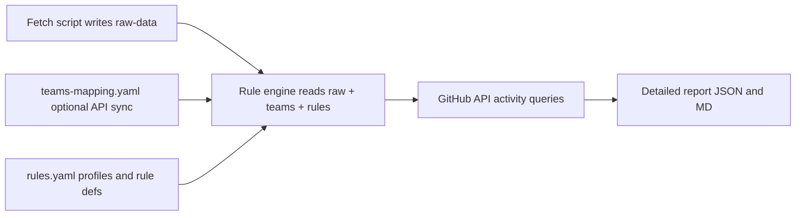
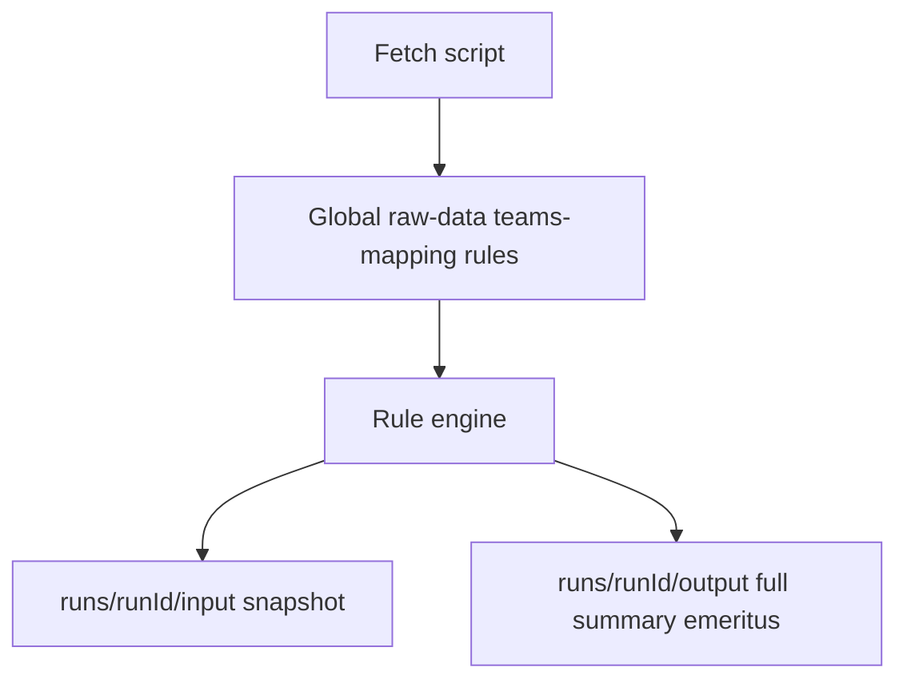

## Documentation and long-term context (Spec Kit + repo docs)

Future contributors (and AI assistants) should not rely on chat history. **Document everything** in the repo so changes to rules, scripts, or outputs stay safe and traceable.

### GitHub Spec Kit (optional but recommended)

- **What it is**: [Spec Kit](https://github.com/github/spec-kit) is GitHub’s open toolkit for **spec-driven development**—treating specifications as **durable artifacts** (with `specify` CLI and a structured workflow) so implementations and iterations stay aligned with product scenarios.
- **How we use it here** (conceptual fit, not a mandate to adopt every CLI command on day one):
  - Initialize or mirror the **spec kit layout** under something like `spec/` (or the kit’s default `memory/` / `specs/` pattern per current release docs) so **constitution**, **feature specs**, and **tasks** for the audit pipeline live in **one place**.
  - Link from Spec Kit’s **tasks/specs** to: rule templates (`RULE_TYPES.md`), bot policy, aggregation semantics, and the **run folder** contract below.
  - Add a short **Cursor rule** or **skill** entry (e.g. `.cursor/rules/audit-pipeline.mdc` or a skill `SKILL.md`) that points maintainers at: global paths, run snapshot behavior, and “never edit `runs/*/input` by hand—regenerate or copy from global.”
- **Outcome**: When someone modifies “any part” (rules, fetch script, new rule kind), they start from **checked-in specs + this plan’s section** instead of guessing.

### Repo-local documentation (minimum)

- `docs/audit/README.md` (or root `AGENTS.md` pointer): **Pipeline overview**, **global file paths**, **how to run**, **what each output means**, **Spec Kit** pointer.
- **Changelog** for rule schema or breaking CLI flags (optional `docs/audit/CHANGELOG.md`).

---

## Run folders: global sources vs per-run snapshots

**Problem:** You will edit **global** `raw-data`, `teams-mapping`, and `rules` over time. Old reports must **not** silently refer to the new global state.

**Solution:** Every engine run creates a **unique run directory** that **freeze-copies** inputs and writes outputs beside them.

### Layout (conceptual)

```text
docs/audit/
  README.md                 # how to run + links to spec
  raw-data.json             # GLOBAL — edit or regenerate via fetch script
  teams-mapping.yaml        # GLOBAL
  rules/                    # GLOBAL rules + templates
  runs/
    2026-03-29T143022Z/     # example run id (ISO-like or timestamp)
      input/                # snapshot of globals **at run start**
        raw-data.json
        teams-mapping.yaml
        rules.yaml            # or copy of the specific rules file path used
        manifest.json         # optional: engine version, git sha, rules file path, cli args
      output/
        full-report.json      # detailed machine-readable per-repo / per-user / per-rule
        full-report.md        # same, human-readable long form
        summary.md            # SHORT rollup (see below)
        emeritus-candidates.md # repo + inactive maintainer usernames (see below)
```

- `**run-id**`: Use an unambiguous id (e.g. UTC `YYYY-MM-DDTHHmmssZ` or `YYYY-MM-DD_HH-mm-ss`). The engine prints the path at end of run.
- `**input/**`: **Copy** (not symlink) from the global paths the run used. If the run points to a non-default rules file, copy **that** file into `input/` with a stable name (e.g. `rules.yaml`) and record the original path in `manifest.json`.
- **Immutability**: Treat `runs/*/input` as **read-only archives** after the run; do not “fix” them—edit **global** files and run again.
- **Git**: Decide whether to **commit** `runs/` (full history, larger repo) or **gitignore** `runs/` and only commit global + scripts (CI can attach artifacts). The plan recommends **committing** at least **one sample run** for onboarding; optionally **ignore** large `full-report.json` via `.gitattributes` or LFS if needed.

### Output artifacts (three tiers)


| Artifact                            | Purpose                                                                                                                                                                                                       |
| ----------------------------------- | ------------------------------------------------------------------------------------------------------------------------------------------------------------------------------------------------------------- |
| `**output/full-report.{json,md}`**  | Full detail: per repo, per person, per rule, pass/fail, evidence strings, reasoning. **Primary** for debugging and audits.                                                                                    |
| `**output/summary.md`**             | **Short** rollup: per **repo** — list **active maintainers**, **active triagers**, and **inactive members** (Emeritus candidates) in one scannable view. Optional small `summary.json` for tooling.           |
| `**output/emeritus-candidates.md`** | Focused table/list: `**repo`** + `**username`** (maintainers who failed overall active per policy), plus optional columns (reason, rule run id). **Feeds** the human `emeritus-log` process after TSC review. |


**Naming:** Keep filenames stable (`summary.md`, `emeritus-candidates.md`) **inside each run** so comparing runs is easy diffing folder-to-folder.

### Global vs run (mental model)

- **Edit** → global files (`docs/audit/raw-data.json`, etc.).
- **Run** → new `runs/<id>/` with `input/` = snapshot, `output/` = results.
- **Compare** → diff two `runs/<id>/output/summary.md` or `emeritus-candidates.md` after changing only global rules.

# AsyncAPI repository audit and consolidation (phase 1: data)

## Scope and numbers

- **Repository set**: All **non-archived** repositories under `org:asyncapi` (GitHub search currently returns **48** such repos; your task mentions **49**—treat the canonical list as whatever the API returns on the audit run and note the delta if it persists).
- **CODEOWNERS location**: GitHub recognizes `[CODEOWNERS](https://docs.github.com/en/repositories/managing-your-repositorys-settings-and-features/customizing-your-repository/about-code-owners)` in the repo root, `.github/`, or `docs/`. In this org, many repos use root `[CODEOWNERS](https://github.com/asyncapi/community/blob/master/CODEOWNERS)` (example from [asyncapi/community](https://github.com/asyncapi/community)); the collector should try `**CODEOWNERS`**, then `**.github/CODEOWNERS`**, then `**docs/CODEOWNERS**` until one exists.
- **This phase**: **Document only**—no archiving, no team membership changes, no CODEOWNERS edits. A follow-on phase uses the same dataset for decisions.

## Configurable rule engine (workflow and files)

The audit is implemented as a **small pipeline** you can re-run after editing data or rules—no code change needed to experiment with thresholds.

### End-to-end flow




1. **Raw data artifact** — produced by a fetch script (or checked in after generation). Contains **only structural facts**: repo names, default branch, raw `CODEOWNERS` text or parsed lists of **maintainer handles**, **triager handles**, **team slugs** referenced in `CODEOWNERS`, and metadata like `pushed_at`. No “active/inactive” labels here.
2. **Teams mapping** — maps `@asyncapi/team-slug` → list of GitHub usernames. **Preferred**: a checked-in file you can edit; **optional**: a subcommand that calls GitHub’s org **Teams** API (`GET /orgs/{org}/teams/{team_slug}/members`) when the token has `read:org` (GitHub MCP in this workspace does **not** expose a dedicated team-members tool, so the engine should use the REST API inside the script or rely on the file).
3. **Rules file** — declares **which rule types run**, parameters (e.g. 12 months), **bot denylists**, **aggregation** (see below), and optional **repo-level flags** (e.g. “low maintenance expected”).
4. **Rule engine** — for each repo, expands teams to people, resolves **subjects** (each maintainer + each triager as separate rows), queries GitHub for **evidence**, evaluates each **rule instance** → `pass` | `fail`, attaches **human-readable reasoning** (e.g. “pass: last commit 2026-02-01 on default branch”), computes **overall** outcome using the configured aggregation, writes **one detailed report**.

### Outputs (required shape)

- **Per repository** section:
  - Repo metadata (url, default branch, optional `pushed_at`, optional manual note like `maintenance_expectation: low`).
  - **Maintainers** (expanded from individuals + team members): for **each person**, for **each rule**, `pass` | `fail`, **evidence** (timestamps, URLs or API ids if useful), and **short reasoning string**.
  - **Triagers** — **same rule definitions** and same columns, in a **separate subsection** after maintainers (for side-by-side and succession planning: e.g. need 3 active maintainers, 2 pass + 1 triager passes → promotion candidate).
- **Machine-readable** duplicate (JSON) for diffing two runs (`jq`, `diff`) when you swap `rules-v1.yaml` vs `rules-v2.yaml`.

### Aggregation: profiles, K-of-N, and opt-in/out

The rules file should support **composable policy** so you can experiment:

- `**profile`** (named presets), e.g.:
  - `strict` → overall PASS iff **all** enabled rules pass.
  - `balanced` → overall PASS iff **any** enabled rule passes.
  - Custom profiles can reference subsets of rules.
- `**k_of_n`** (optional block): e.g. “overall PASS if **at least K** distinct rules pass out of N enabled” — **toggle on/off** so you can run **profile-only**, **K-of-N-only**, or **both** if you define a clear order (documented in schema: e.g. first compute per-rule passes, then apply K-of-N, then apply profile as a second layer—or make these **mutually exclusive** via `aggregation.mode: profile | k_of_n | none` where `none` means “report rules only, no overall column”).
- **Triagers** use the **same rule definitions**; only the **report grouping** differs.

Exact schema is implementation detail, but the plan requires **explicit fields** so no ambiguity when comparing runs.

### Bot and automation handling (must be rule-level or global defaults)


| Actor              | Treatment                                                                                                                                                                                                                                                                       |
| ------------------ | ------------------------------------------------------------------------------------------------------------------------------------------------------------------------------------------------------------------------------------------------------------------------------- |
| `asyncapi-bot-eve` | Never a **subject** for maintainer/triager (already omitted from CODEOWNERS parsing). Never counts as a **reviewer** for “reviewed a PR” rules.                                                                                                                                 |
| `asyncapi-bot`     | **PRs authored** by this user are **excluded** from “human PR activity” rules. If, in window `W`, the **only** merged PRs are from `asyncapi-bot`, treat as **no human PRs** for that window (and surface that in repo-level notes). Same for “last meaningful PR” style rules. |
| Config             | Rules file should list **denylisted bot logins** and **PR author ignore list** so you can extend without code changes.                                                                                                                                                          |


### Rule types to support in templates (extensible list)

Document each in `**RULE_TYPES.md`** with YAML examples. Initial set:

- **Time-windowed commit activity** — last author commit on default branch (or all branches) within `W`.
- **Human PR activity** — merged PR **authored** by user in repo, excluding denylisted bots; optional “exclude merge commits from bot PR chains.”
- **PR review activity** — user submitted review on a PR not authored by self; exclude reviews on PRs where only bots are involved if feasible (v1: exclude reviews where PR author is in bot list).
- **Issue / discussion** — comments or interactions on issues in repo (heavier noise; optional).
- **Last interaction (any)** — max of several signals (commits, PRs, issues, reviews) as a single “heartbeat” rule.
- **Org-wide activity** (optional cross-repo rule) — any activity in `asyncapi/*` within `W` (for interpreting Emeritus vs “moved to other repos”).
- **Repo quiet / low expected maintenance** — flag from raw data or rules file: e.g. if `maintenance_expectation: low`, **downgrade** severity or **skip** certain rules (must be explicit in template so you do not silently hide gaps).

**Extensibility**: implement the engine with **internal plugins** per rule type string (`kind: commit_activity`) so new kinds can be added without changing the CLI contract.

### Raw data file (conceptual schema)

Minimum fields per repo:

- `name`, `full_name`, `default_branch`, `html_url`
- `codeowners_raw` (string) and/or parsed arrays: `maintainers_individuals[]`, `teams[]`, `triagers[]`
- `fetched_at` (ISO timestamp)

No derived “active” booleans in raw data.

### Teams file (conceptual schema)

- Keyed by team slug or full `@asyncapi/name`
- `members: [github_username, ...]`
- Optional `last_synced_at` if API sync is used

### Experimentation workflow

1. Edit **global** files under `docs/audit/` (e.g. copy `rules/examples/balanced.yaml` → `rules/my-experiment.yaml` and point the CLI at it).
2. Adjust windows, enable/disable rule kinds, switch aggregation.
3. Run the engine; it creates `**docs/audit/runs/<run-id>/`** with `**input/`** (snapshot of the exact globals used) and `**output/`** (`full-report`, `summary`, `emeritus-candidates`).
4. Change globals and re-run; **diff** `runs/<id-a>/output/` vs `runs/<id-b>/output/` (especially `summary.md` / `emeritus-candidates.md`).

Optional: keep a **checked-in** `raw-data.json` snapshot in global for diffs even when live GitHub data drifts between runs.

## What to extract from each `CODEOWNERS`


| Bucket                            | Rule                                                                                                                                                                    |
| --------------------------------- | ----------------------------------------------------------------------------------------------------------------------------------------------------------------------- |
| **Maintainers (effective)**       | From **non-comment** lines: collect `@username` and `@org/team` entries that GitHub would treat as owners. **Exclude** `@asyncapi-bot-eve`.                             |
| **Triagers / future maintainers** | From **comment** lines (`#`…): parse lines that denote triagers (e.g. labels like `#docTriagers:`, or commented-out `@handles`). Store **separately** from maintainers. |
| **Teams**                         | Keep `@asyncapi/...` teams as distinct entries (they are not individual humans but matter for “who owns this”).                                                         |


**Parsing caveats** (worth encoding in the script or a short “rules” section in the audit doc):

- **Order/precedence**: GitHub applies last matching pattern; for a **roll-up list of “who can review the repo”**, a practical approach is: union all `@` owners from all non-comment rule lines (document that this is an approximation unless you later simulate path matching).
- **Ambiguity**: Some comments are prose, not triagers—either capture “raw commented lines” for manual cleanup or use keyword patterns (`triag`, `future`, `trainee`, `# @user`).

Example pattern from real data (`[asyncapi/community` `CODEOWNERS](https://github.com/asyncapi/community/blob/master/CODEOWNERS)`): active line `* @user1 @user2 @asyncapi-bot-eve`; triager hint `#docTriagers: CBID2` in comments.

## Judgement logic: active vs inactive maintainers, repo health, and Emeritus

**Implementation note:** The mechanics of thresholds, windows, and pass/fail are **not** fixed in application code—they are expressed in the **rules file** and **rule templates** described in **Configurable rule engine** above. This section keeps the **conceptual model** TSC can align on; the engine + templates make it operational and comparable across experiments.

This is the **core decision method** for the audit: **CODEOWNERS alone cannot prove someone is “active.”** It only records **designation** (who should be asked for review / who the project treats as a maintainer). **Activity** must be inferred from **observable GitHub behavior** using rules that are **documented, versioned, and reproducible** (same inputs → same labels on re-run).

### 1) Separate three concepts (avoid mixing them)


| Concept                             | Meaning                                                                                                                                                        | Source                             |
| ----------------------------------- | -------------------------------------------------------------------------------------------------------------------------------------------------------------- | ---------------------------------- |
| **Designated maintainer**           | Listed in `CODEOWNERS` (non-comment), excluding `asyncapi-bot-eve`                                                                                             | Parsed file                        |
| **Active maintainer (operational)** | A **person** who meets the **activity threshold** for **this repo** (or org-wide, if you add that lens)                                                        | GitHub API time-series             |
| **Healthy / “active” repo**         | A **repository** that has **at least one** active human maintainer (or a justified team substitute—see below) and optionally passes a **project health** check | Derived from rows above + metadata |


**Repo “active or not” in the sense of your task** should mean: **maintenance capacity**, not “lots of commits.” A repo can be quiet but **healthy** if someone with merge/review responsibility is still engaged on a human-relevant cadence.

### 2) What signals to use for a **person** (recommended order)

Use **primary** signals first; add **secondary** only if you need to reduce false “inactive” labels.

**Primary (strong, automatable)**

- **Last commit authorship** by that GitHub user **in this repository** (default branch is enough for v1; full default-branch history is the usual scope).
- **Last merged pull request** where the user is **author** (captures maintenance that lands via PRs even if commit metadata is noisy).

Define a single **inactivity window** `W` (e.g. **12 months** or **24 months**). Record which `W` you used in the audit header.

**Secondary (reduces false negatives for “review-only” maintainers)**

- **Pull request reviews** (approve/request changes) in the repo in the last `W` — important if some maintainers rarely commit but regularly review.

**Optional org-wide lens (interpretation, not a replacement)**

- **Last contribution to any `asyncapi/*` repo** — helps distinguish “left this repo but still active elsewhere” vs “likely stepped back from the org’s maintenance work.” This does **not** by itself fix a repo that has **no** active designated maintainer **for that repo**; it only informs **Emeritus** discussions.

**What not to use as sole proof**

- Issue comments alone (noisy; good as a **manual** override, bad as the only rule).
- Stars/forks (popularity ≠ maintenance).

### 3) Decision rules (maintainer → Emeritus **candidate**, not automatic removal)

Treat automation as **labeling**, not **authority**. Human/TSC review remains the gate for actually moving someone to Emeritus.

**Rule A — Inactive maintainer (Emeritus candidate) for repo `R`**

A **human** username appears as a designated maintainer in `R`’s `CODEOWNERS`, and **within window `W`**:

- **No** commits authored to `R` (per your chosen branch scope), **and**
- **No** merged PRs authored in `R`, **and**
- If you enabled review signal: **no** substantive PR reviews in `R` (define “substantive”: e.g. at least one review event, or exclude self-owned PRs).

If all three (or two if you skip reviews) fail the activity test → flag `**emeritus_candidate`** with **reason codes** (see below).

**Rule B — Active maintainer for repo `R`**

Meets **any** of the positive signals above within `W` (commit **or** merged PR **or** review, per what you enabled).

**Rule C — Teams (`@asyncapi/...`)**

Teams are **not** people. Do not emit an Emeritus row for a team. Options:

- **Conservative**: mark repo as “**designated ownership includes team** — human activity must be validated via team roster + separate process,” or
- **Advanced** (later): expand team to members via API and apply the same person rules (higher cost and governance sensitivity).

**Rule D — Bots**

`asyncapi-bot-eve` is excluded from maintainer lists and from Emeritus logic. `**asyncapi-bot`** PRs are excluded from “human” activity; see the **Bot and automation handling** table in the rule engine section.

### 4) From people to **repository** health (the “main factor” for repo active/inactive)

After each repo has a set of **designated humans** and **activity flags**:

- `**repo_maintenance_status = healthy`** if **at least one** designated **human** maintainer is **active** under Rule B **for this repo**.
- `**repo_maintenance_status = at_risk`** if **no** designated human is active under Rule B, including cases with:
  - only the bot,
  - only teams (unless you explicitly count team resolution),
  - humans who are all `emeritus_candidate` for this repo.
- **Optional nuance**: `stale_project` — use `**pushed_at`** (or last default-branch commit date) as **ecosystem momentum**, not as a substitute for maintainer rules. A repo can be **at_risk** even if `pushed_at` is recent (if all activity is from bots or drive-by contributors without designated owners), and conversely a slow repo can still be **healthy** if an active maintainer is present but release cadence is slow.

This gives you a **single coherent story**: **repo status follows from “is there an active designated human maintainer for this repo?”** with **transparent thresholds**, not from popularity alone.

### 5) Reason codes for `emeritus-log.md` (machine + human)

Store structured reasons so rows are auditable:

- `NO_COMMITS_IN_W` — no commits authored in repo in window `W`
- `NO_MERGED_PRS_IN_W` — no merged PRs authored in repo in window `W`
- `NO_REVIEWS_IN_W` — if review signal enabled
- `ORG_ACTIVE_ELSEWHERE` — optional note: user active in other asyncapi repos in `W` (policy decision: still Emeritus for **this** repo vs org role)
- `MANUAL_OVERRIDE_PENDING` — review-only maintainer, sabbatical, etc.

### 6) Limitations (disclose in the audit doc)

- **Squash merges** can attribute commits to one user; **co-authors** may be undercounted—note in methodology.
- **Email mismatch** (commit email ≠ GitHub noreply) can hide activity—rare but real; allow manual override column.
- **Short windows** punish slow-release repos; **long windows** hide gradual drift—pick `W` deliberately and document it.

### 7) Implementation note for the script

Phase 1 can ship **CODEOWNERS + repo metadata** first, then a **second pass** that queries **per-user-per-repo** activity (commits/PRs/reviews) with strict rate-limit handling. The **judgement logic above stays the same**; only the data completeness improves.

## How this maps to the problem statement (analysis, not actions yet)

Use the inventory to support **O1/O2-style** discussion:

1. **Designated maintainers vs active maintainers** — parsed CODEOWNERS gives **designation**; the **judgement logic** section above labels who is **active** vs **Emeritus candidate** per repo and drives **repo maintenance status**.
2. **Critical repos** — start from a **transparent rubric** in the doc (you can adjust weights later), for example:
  - **Tier A**: spec stack (`spec`, `spec-json-schemas`), user-facing (`website`, `studio`, `cli`), core libraries (`parser-js`, `generator`, `modelina`), org-wide infra (`.github`, `community`).
  - **Tier B**: widely depended-on templates/parsers.
  - **Tier C**: long tail.
  - Add columns: `default_branch`, `pushed_at`, `open_issues_count` from the GitHub API for context.
3. **Consolidation / inactive repos** — **do not archive in phase 1**; tag repos using `**repo_maintenance_status`** (from judgement logic) plus optional momentum signals (`pushed_at`). **At-risk** repos flow to “can someone take ownership?”
4. **Emeritus** — rows in `**emeritus-log.md`** should be populated only for `**emeritus_candidate`** people with **reason codes**; **no automatic org changes**—TSC/humans confirm before any role change.

Suggested layout under the community repo (**global** vs **per-run** — see **Run folders** at the top of this plan):

- **Global (editable sources)**  
  - `[docs/audit/raw-data.json](docs/audit/raw-data.json)` — raw repo + CODEOWNERS-derived lists.  
  - `[docs/audit/teams-mapping.yaml](docs/audit/teams-mapping.yaml)` — team slug → members.  
  - `[docs/audit/rules/](docs/audit/rules/)` — `rules.schema`, `RULE_TYPES.md`, `examples/*.yaml`.  
  - `[docs/audit/README.md](docs/audit/README.md)` — pipeline + link to Spec Kit / spec folder.  
  - Optional: `[spec/](spec/)` or Spec Kit layout — constitution/tasks for the audit; see **Documentation and long-term context**.
- **Per run (frozen)** — `[docs/audit/runs/<run-id>/input/](docs/audit/runs/)` + `[output/](docs/audit/runs/)` with `full-report`, `summary`, `emeritus-candidates`.  
- **Governance after review** — `[docs/audit/emeritus-log.md](docs/audit/emeritus-log.md)` (or org-wide doc): **human** approved Emeritus moves; may be populated **from** a chosen run’s `emeritus-candidates.md`, not overwritten by the engine blindly.

## Data collection mechanics




- **List repos**: GitHub API `search/repositories` with `org:asyncapi archived:false` (paginate until complete) or `GET /orgs/asyncapi/repos` with `type=all` and filter `archived: false`.
- **Fetch file**: Contents API for each candidate path on `default_branch` (use each repo’s `default_branch`—`master` vs `main`).
- **Rate limits**: Implement sequential requests with backoff or a small concurrency limit (e.g. 5–10 parallel); cache raw `CODEOWNERS` text in the JSON artifact for traceability.
- **Enrichment** (still read-only): per repo, attach `pushed_at`, `updated_at`, `open_issues_count`, `html_url`. **Second pass** (required for Emeritus/repo-risk labels): per **human** maintainer per repo, query activity within window `W` — see **Judgement logic** section above (commits, merged PRs, optional reviews).

**Automation**: Two entry points (same language stack): `scripts/audit-fetch-raw.mjs` (or similar) and `scripts/audit-rule-engine.mjs`, plus `package.json` scripts like `audit:fetch` and `audit:run -- --rules docs/audit/rules/my.yaml`. Document `GITHUB_TOKEN` scopes: `**repo`** for private repos if any; `**read:org`** if using team membership API; public-only audits may work with narrower scopes for activity endpoints—validate against GitHub docs when implementing.

## Gaps and manual follow-up

- Repo **without** `CODEOWNERS`: record `codeowners_status: missing` and list under **gaps**.
- **Teams** in CODEOWNERS: the Emeritus log applies to **people**; team membership changes are a separate, org-admin step later.

## What we are deferring (explicitly)

- Changing GitHub teams, repo settings, or `CODEOWNERS` files.
- Archiving or merging repositories until leadership reviews the documented dataset.

