This document covers the aspect of different meetings organization at AsyncAPI.

## FAQ

### What do I need to schedule a meeting?

To schedule a meeting, you need to be:
- one of the licensed Zoom users associated with the AsyncAPI Zoom account. It is required because only licensed users can start meeting, live transcripts, and streaming.
- GitHub Action workflow for `Ad Hoc` meeting scheduling should be updated. Newly licensed users should be added as alternative hosts.
- a member of [GitHub team called meetings-organizars](https://github.com/orgs/asyncapi/teams/meetings-organizers). It is required because only maintainers of the given repository can manually trigger GitHub Actions workflows. This group has a `Maintain` role in the `community` repository where meeting automation is implemented.
- a member of a team in the AsyncAPI Restream account. It is required because hosts must log in to Restream before they start streaming the meeting from Zoom and modify the stream's title that will show up on social platforms.
- a member of the AsyncAPI YouTube account. It is required because after the meeting is over, hosts need to add live their stream recording to the proper YouTube Playlist to improve recording discoverability.

### What meetings do we have?

* `Regular` meetings: regular meetings with a dedicated area of interest and individual brand (Examples: `Community Meeting` or `Thinking Out Loud`) 
* `Ad Hoc` meetings: meetings for topics that do not match any **regular** meetings and should be organized separately. Every official AsyncAPI Zoom licensed user should have the right to schedule it.

### How do I schedule a new meeting?

1. Go to [**Actions** tab](https://github.com/asyncapi/community/actions)
1. Select one of the workflows that start with **Schedule**. Choose one that represents the meeting you want to schedule.
1. Click the **Run workflow** button.
1. Provide data required by the form and click the **Run workflow** button within the form.

We have an automated workflow in place:
1. Automation starts after clicking **Run workflow**.  (Unless there is another GitHub Actions outage and proper events are not delivered to automation :smiley: )
1. It creates a new meeting in Zoom. It is by default configured to support live streaming
1. It creates a GitHub issue with all details about the meeting
1. It creates a new Google Calendar entry with special metadata containing the GitHub issue number
1. It sends a tweet with information about a newly scheduled event

### What are my responsibilities as meeting host?

Technically there are two types of meetings:
- Zoom-first: Meeting takes place on Zoom and through integration with Restream.io it is streamed to different channels. These meetings happen on Zoom to enable as many people as possible to join live conversation.
- Restream-first: Meeting takes place on Restream and is is streamed to different channels. These meetings are focused on showing or explaining some topic without live audio conversation with the audience.

#### Zoom-first

This is what you need to do to kick it off:

1. Start your meeting by opening a Zoom meeting. Make sure you are logged into Zoom with your AsyncAPI licensed account.

1. Log into [Restream.io](https://app.restream.io/home) and select `Set up for OBS, Zoom, etc.` option:

    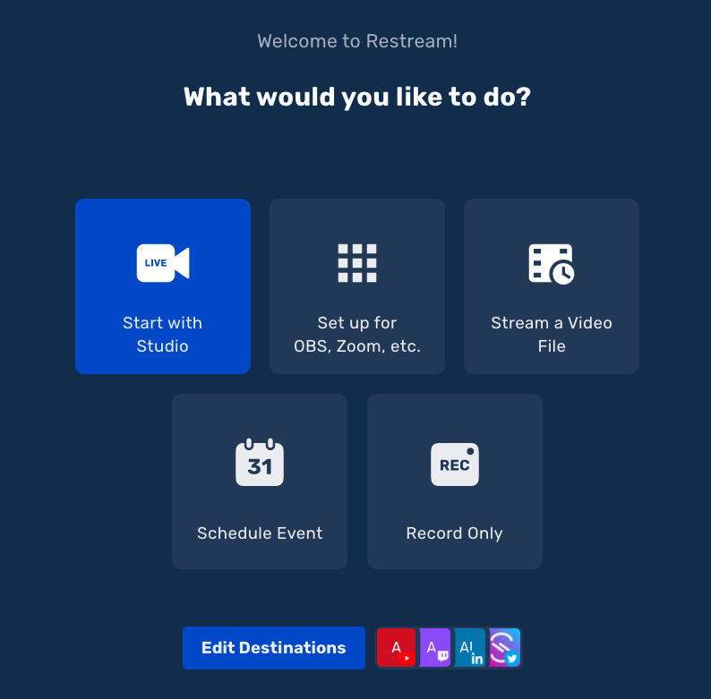

1. Click `Update Titles` card:

    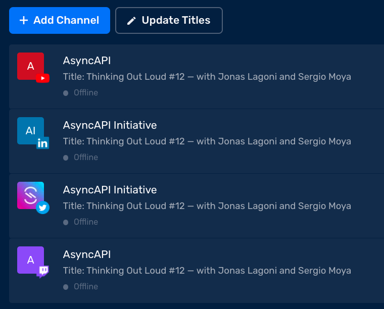

1. Provide title and description:

    - Title for the live stream that corresponds with the meeting you just started,
    - Meeting description must be provided even if the field is empty, otherwise the old one from other streams will be used.

    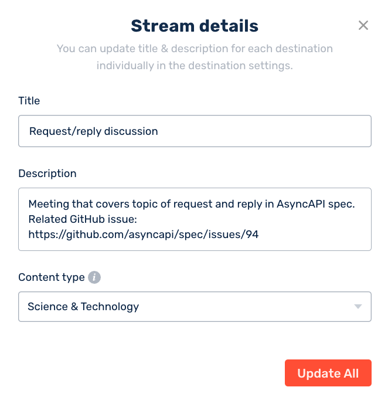

1. In Zoom, click the `Live Transcript` button to start transcribing the meeting:

    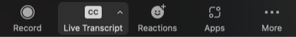

1. Confirm transcriptions with `Enable` button:

    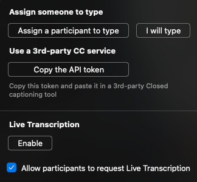

1. Click `More`:

    

1. Select `Live on Custom Live Stream Service` option to start streaming to Restream and, therefore, to official AsyncAPI social networks:

    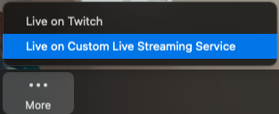

#### Restream-first

You need to first start with YouTube, even though Restream can directly stream there. It is because by 

This is what you need to do to kick it off:

1. In [YouTube](https://youtube.com) click on your profile picture and select `Switch account`:

    

1. Select `AsyncAPI`. If you do not see it on the list, means you did not have all access rights needed to setup a live stream:

    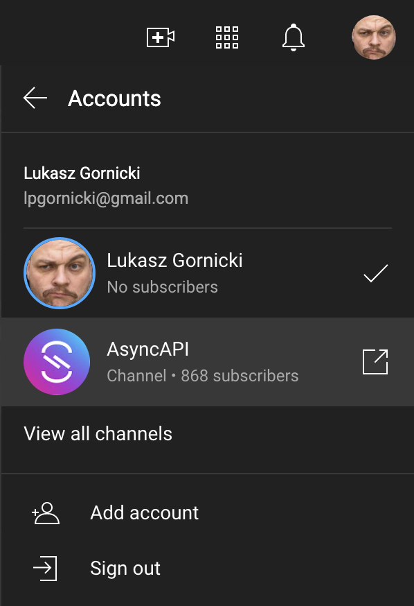

1. Click on `Create` and select `Go live`:

    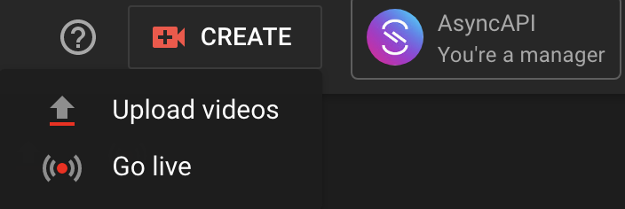

1. Once new live stream is created, in the list of `Upcomming` streams, click `View in Live Control Room` 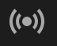 icon next to your live stream:

    

1. Enable `Closed captions`:

    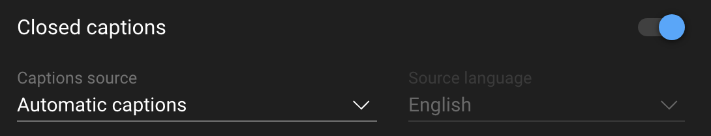

1. Log into [Restream.io](https://app.restream.io/home) and select `Start with Studio` option:

    

1. After enabling audio, video and providing name, you will see a Restream Studio. 

1. `Edit` the title and description of the stream:

    

1. Provide title and description and click `Next`:

    - Title for the live stream that corresponds with the meeting you just started,
    - Meeting description must be provided even if the field is empty, otherwise the old one from other streams will be used.

    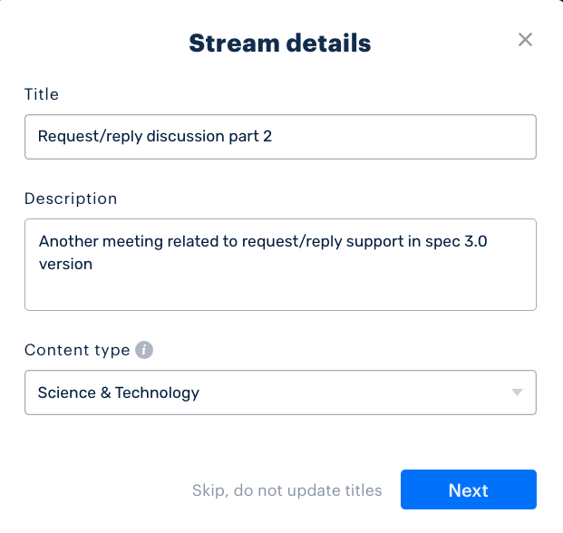

1. `Edit` YouTube destination:

    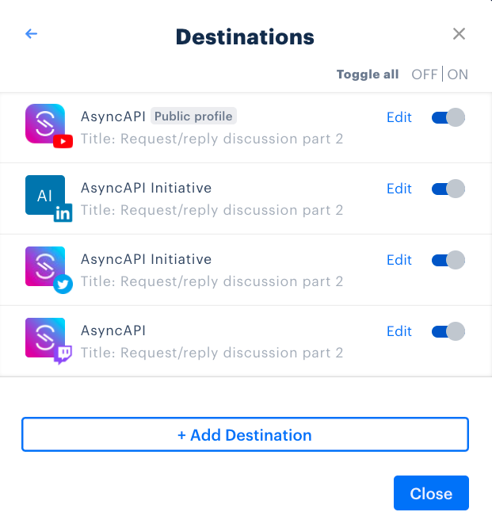

1. Make sure you do not create new event but you select the one you already created on YouTube, with closed captions on:

    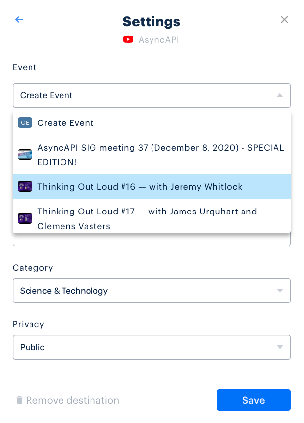

1. You are ready to `Go Live`

#### Post meeting

Once the meeting is over, if applicable:

1. Provide related GitHub Issue meeting notes and then close the issue.
1. Login to YouTube and add the recorded live stream to the respective YouTube Playlist.

### How can I get notified about upcoming meetings?

Subscribe to the [AsyncAPI Newsletter](https://asyncapi.com/newsletter) to get information about upcoming meetings.

We have an automated workflow in place:
1. Automation starts every Friday at midnight
1. It gets information from Google Calendar about all the meetings scheduled for the upcoming week
1. It schedules a MailChimp campaign to send emails with a list of meetings. It's sent on Friday at 11AM in the subscriber's time zone

### Where can I find the AsyncAPI calendar?

- [Main link to calendar](https://calendar.google.com/calendar/embed?src=c_q9tseiglomdsj6njuhvbpts11c%40group.calendar.google.com&ctz=UTC)
- [iCal/ics file](https://calendar.google.com/calendar/ical/c_q9tseiglomdsj6njuhvbpts11c%40group.calendar.google.com/public/basic.ics)

### How do I cancel a meeting?

If you need to cancel a meeting, simply close the corresponding meeting issue.

We have an automated workflow in place:
1. Automation starts when the GitHub issue is closed
1. It checks if a closed issue represents a future event
1. It removes meetings from the AsyncAPI Google Calendar

### How do I register a new regular meeting?

Start [discussion in community repository](https://github.com/asyncapi/community/discussions). Explain the idea and justify why it requires a separate meeting. We currently have [approval from the Technical Steering Commitee](https://github.com/asyncapi/community/discussions/295) to pay for up to 8 Zoom licenses.

Once a new meeting is approved, add a [new workflow like this one](.github/workflows/create-event-community-meeting.yml) and a [new GitHub issue template like this one](.github/workflows/create-event-helpers/issues_templates/community.md).

### How can I become a host?

Once your `Regular` meeting gets approved, contact `Fran Mendez` so that he can give you access to all required tools.
