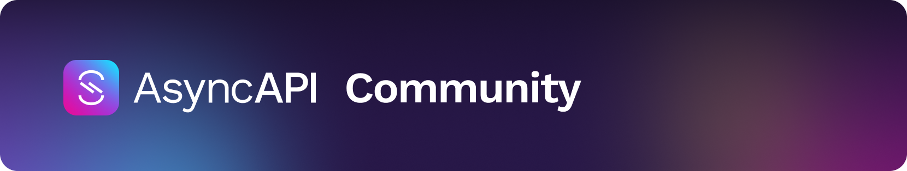
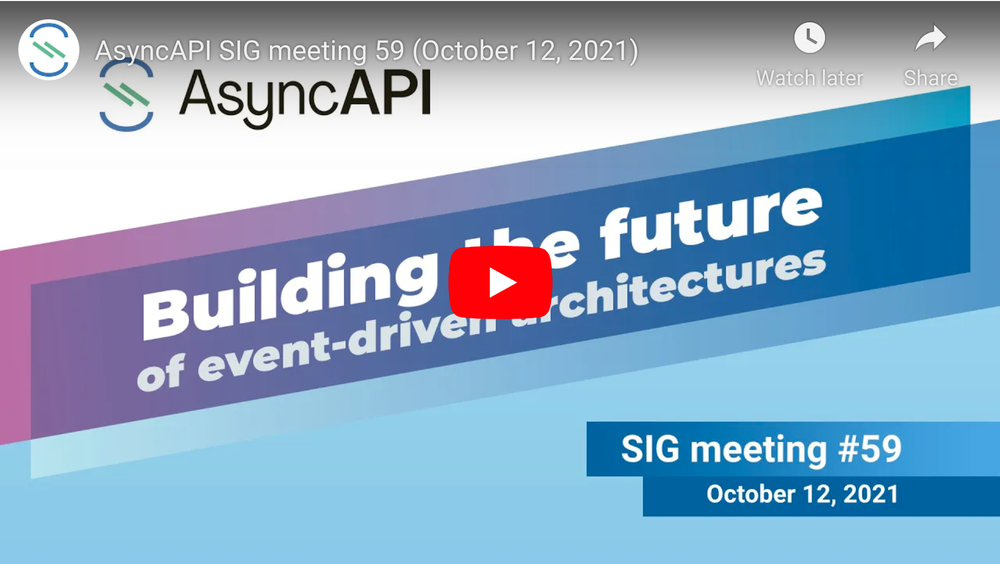

  
 
 

<h4 align="left">Building the future of event-driven architectures</h4>
<h6 align="left">We're on a mission to standardize message-based communication and increase interoperability of the different systems out there.</h6>

  <a href="https://www.github.com/asyncapi/spec">Specification</a>
  |
  <a href="https://playground.asyncapi.io/">Playground</a>
  |
  <a href="https://www.asyncapi.com/roadmap">Roadmap</a>
  |
  <a href="./CONTRIBUTING.md">Contributing</a>
  |
  <a href="https://www.asyncapi.com/slack-invite">Slack</a>
  |
  <a href="https://www.youtube.com/channel/UCIz9zGwDLbrYQcDKVXdOstQ">Youtube</a>
  |
  <a href="https://opencollective.com/asyncapi">Donate 🙌🏾</a>

## 💰 Platinum sponsors

  
  &nbsp;&nbsp;&nbsp;&nbsp;
  
  &nbsp;&nbsp;&nbsp;&nbsp;
  
  &nbsp;&nbsp;&nbsp;&nbsp;
  
  &nbsp;
  
  &nbsp;
  
  &nbsp;
  

  🙌🏾 <a href="https://opencollective.com/asyncapi">Become a sponsor</a> 🙌🏾

## 🤗 AsyncAPI community meetings
AsyncAPI hosts and records community interest meetings bi-weekly on Tuesdays. We rotate the time at which we host these meetings; 4:00pm UTC one Tuesday and 8:00am UTC the next Tuesday. Rotating the time of our community meetings allows us to meet with community members from APAC, Europe, Africa, and Americas. 🌎 🌍 🌎

## 🗓️ Add AsyncAPI meetings to calendar
There are two simple ways to join _any_ and _all_ AsyncAPI community meetings:
- **Add our calendar:** check out when we meet next with [this calendar](https://calendar.google.com/calendar/u/0/embed?src=tbrbfq4de5bcngt8okvev4lstk@group.calendar.google.com)! 🗓️
  - If you have a **google account**, you can use [this link](https://calendar.google.com/calendar?cid=dGJyYmZxNGRlNWJjbmd0OG9rdmV2NGxzdGtAZ3JvdXAuY2FsZW5kYXIuZ29vZ2xlLmNvbQ) to get the AsyncAPI calendar added to your calendar.
   - If you prefer to add the calendar with an **ICS file**, download it [here](https://calendar.google.com/calendar/ical/tbrbfq4de5bcngt8okvev4lstk%40group.calendar.google.com/public/basic.ics).

- **Join our [mailing list](https://groups.google.com/forum/#!forum/asyncapi-users):** receive an invite to our next meeting. 📨  

## 💻 Join AsyncAPI meetings
Great news! You can join our community meetings with Zoom or [from your phone](https://zoom.us/zoomconference?u=KVQB7xXTBuFX2L-UkCopBrikvzkqiU314jvIVWrLieg&_x_zm_rtaid=0PMYw_lVTpm8tPIxhJ2vAA.1634191563246.6cc9c2f6cda6a2c1639ce2584cbeee6a&_x_zm_rhtaid=430) with our **Meeting ID: 165 106 914**. Follow the agenda for both past and future meetings [here](https://github.com/asyncapi/community/issues?utf8=%E2%9C%93&q=is%3Aissue+label%3Ameeting+sort%3Acreated-desc+), in our GitHub pinned issue 🐙.

👉🏾 Join our [Zoom call](https://zoom.us/j/165106914) from your favorite device. 

## 🎥 Watch meeting recordings

Head over to our [AsyncAPI YouTube playlist of SIG meetings](https://www.youtube.com/watch?v=S8gvf0XjO10&list=PLbi1gRlP7pijUwZJErzyYf_Rc-PWu4lXS) to watch them. 

## Contributors

Thanks goes to these wonderful people ([emoji key](https://allcontributors.org/docs/en/emoji-key)):

<!-- ALL-CONTRIBUTORS-LIST:START - Do not remove or modify this section -->
<!-- prettier-ignore-start -->
<!-- markdownlint-disable -->
<table>
  <tr>
    <td align="center"><a href="http://resume.github.io/?derberg"> <b>Lukasz Gornicki</b></a> <a href="https://github.com/asyncapi/community/commits?author=derberg" title="Documentation">📖</a> <a href="#ideas-derberg" title="Ideas, Planning, & Feedback">🤔</a> <a href="https://github.com/asyncapi/community/pulls?q=is%3Apr+reviewed-by%3Aderberg" title="Reviewed Pull Requests">👀</a> <a href="https://github.com/asyncapi/community/commits?author=derberg" title="Code">💻</a> <a href="#question-derberg" title="Answering Questions">💬</a> <a href="#eventOrganizing-derberg" title="Event Organizing">📋</a> <a href="#content-derberg" title="Content">🖋</a> <a href="#blog-derberg" title="Blogposts">📝</a> <a href="#tool-derberg" title="Tools">🔧</a> <a href="#talk-derberg" title="Talks">📢</a> <a href="#maintenance-derberg" title="Maintenance">🚧</a> <a href="https://github.com/asyncapi/community/commits?author=derberg" title="Tests">⚠️</a></td>
    <td align="center"><a href="http://mermade.github.io"> <b>Mike Ralphson</b></a> <a href="#question-MikeRalphson" title="Answering Questions">💬</a> <a href="https://github.com/asyncapi/community/commits?author=MikeRalphson" title="Documentation">📖</a> <a href="https://github.com/asyncapi/community/commits?author=MikeRalphson" title="Code">💻</a> <a href="#ideas-MikeRalphson" title="Ideas, Planning, & Feedback">🤔</a> <a href="#infra-MikeRalphson" title="Infrastructure (Hosting, Build-Tools, etc)">🚇</a> <a href="https://github.com/asyncapi/community/pulls?q=is%3Apr+reviewed-by%3AMikeRalphson" title="Reviewed Pull Requests">👀</a> <a href="https://github.com/asyncapi/community/commits?author=MikeRalphson" title="Tests">⚠️</a> <a href="#tool-MikeRalphson" title="Tools">🔧</a> <a href="#maintenance-MikeRalphson" title="Maintenance">🚧</a> <a href="#eventOrganizing-MikeRalphson" title="Event Organizing">📋</a></td>
    <td align="center"><a href="https://github.com/rmelian"> <b>raisel melian</b></a> <a href="#question-rmelian" title="Answering Questions">💬</a> <a href="https://github.com/asyncapi/community/issues?q=author%3Armelian" title="Bug reports">🐛</a> <a href="https://github.com/asyncapi/community/commits?author=rmelian" title="Code">💻</a> <a href="https://github.com/asyncapi/community/commits?author=rmelian" title="Documentation">📖</a> <a href="#ideas-rmelian" title="Ideas, Planning, & Feedback">🤔</a> <a href="#maintenance-rmelian" title="Maintenance">🚧</a> <a href="https://github.com/asyncapi/community/pulls?q=is%3Apr+reviewed-by%3Armelian" title="Reviewed Pull Requests">👀</a> <a href="#tool-rmelian" title="Tools">🔧</a> <a href="https://github.com/asyncapi/community/commits?author=rmelian" title="Tests">⚠️</a></td>
    <td align="center"><a href="http://www.fmvilas.com"> <b>Fran Méndez</b></a> <a href="#question-fmvilas" title="Answering Questions">💬</a> <a href="https://github.com/asyncapi/community/issues?q=author%3Afmvilas" title="Bug reports">🐛</a> <a href="#blog-fmvilas" title="Blogposts">📝</a> <a href="#business-fmvilas" title="Business development">💼</a> <a href="https://github.com/asyncapi/community/commits?author=fmvilas" title="Code">💻</a> <a href="#content-fmvilas" title="Content">🖋</a> <a href="https://github.com/asyncapi/community/commits?author=fmvilas" title="Documentation">📖</a> <a href="#design-fmvilas" title="Design">🎨</a> <a href="#financial-fmvilas" title="Financial">💵</a> <a href="#fundingFinding-fmvilas" title="Funding Finding">🔍</a> <a href="#ideas-fmvilas" title="Ideas, Planning, & Feedback">🤔</a> <a href="#infra-fmvilas" title="Infrastructure (Hosting, Build-Tools, etc)">🚇</a> <a href="#maintenance-fmvilas" title="Maintenance">🚧</a> <a href="#plugin-fmvilas" title="Plugin/utility libraries">🔌</a> <a href="https://github.com/asyncapi/community/pulls?q=is%3Apr+reviewed-by%3Afmvilas" title="Reviewed Pull Requests">👀</a> <a href="#tool-fmvilas" title="Tools">🔧</a> <a href="https://github.com/asyncapi/community/commits?author=fmvilas" title="Tests">⚠️</a> <a href="#tutorial-fmvilas" title="Tutorials">✅</a> <a href="#talk-fmvilas" title="Talks">📢</a> <a href="#eventOrganizing-fmvilas" title="Event Organizing">📋</a></td>
    <td align="center"><a href="https://github.com/DulceDeLaRosa"> <b>dulce</b></a> <a href="#design-DulceDeLaRosa" title="Design">🎨</a></td>
    <td align="center"><a href="https://github.com/SensibleWood"> <b>Chris Wood</b></a> <a href="https://github.com/asyncapi/community/commits?author=SensibleWood" title="Code">💻</a> <a href="#ideas-SensibleWood" title="Ideas, Planning, & Feedback">🤔</a> <a href="https://github.com/asyncapi/community/commits?author=SensibleWood" title="Documentation">📖</a></td>
    <td align="center"><a href="https://github.com/jschabowsky"> <b>Jonathan Schabowsky</b></a> <a href="https://github.com/asyncapi/community/commits?author=jschabowsky" title="Documentation">📖</a> <a href="#fundingFinding-jschabowsky" title="Funding Finding">🔍</a> <a href="#ideas-jschabowsky" title="Ideas, Planning, & Feedback">🤔</a></td>
  </tr>
  <tr>
    <td align="center"><a href="https://github.com/vromero"> <b>Victor Romero</b></a> <a href="#ideas-vromero" title="Ideas, Planning, & Feedback">🤔</a> <a href="https://github.com/asyncapi/community/pulls?q=is%3Apr+reviewed-by%3Avromero" title="Reviewed Pull Requests">👀</a></td>
    <td align="center"><a href="http://antoniogarrote.wordpress.com"> <b>Antonio Garrote</b></a> <a href="#ideas-antoniogarrote" title="Ideas, Planning, & Feedback">🤔</a> <a href="https://github.com/asyncapi/community/pulls?q=is%3Apr+reviewed-by%3Aantoniogarrote" title="Reviewed Pull Requests">👀</a></td>
    <td align="center"><a href="https://ramses.tech"> <b>Jonathan Stoikovitch</b></a> <a href="#fundingFinding-jstoiko" title="Funding Finding">🔍</a> <a href="#example-jstoiko" title="Examples">💡</a> <a href="#ideas-jstoiko" title="Ideas, Planning, & Feedback">🤔</a> <a href="https://github.com/asyncapi/community/pulls?q=is%3Apr+reviewed-by%3Ajstoiko" title="Reviewed Pull Requests">👀</a></td>
    <td align="center"><a href="https://github.com/jonaslagoni"> <b>Jonas Lagoni</b></a> <a href="https://github.com/asyncapi/community/issues?q=author%3Ajonaslagoni" title="Bug reports">🐛</a> <a href="https://github.com/asyncapi/community/commits?author=jonaslagoni" title="Code">💻</a> <a href="https://github.com/asyncapi/community/commits?author=jonaslagoni" title="Documentation">📖</a> <a href="#ideas-jonaslagoni" title="Ideas, Planning, & Feedback">🤔</a> <a href="#question-jonaslagoni" title="Answering Questions">💬</a> <a href="#eventOrganizing-jonaslagoni" title="Event Organizing">📋</a></td>
    <td align="center"><a href="http://evamorcillo.com/"> <b>Eva</b></a> <a href="#ideas-evamorcillo" title="Ideas, Planning, & Feedback">🤔</a> <a href="#business-evamorcillo" title="Business development">💼</a> <a href="#eventOrganizing-evamorcillo" title="Event Organizing">📋</a></td>
    <td align="center"><a href="https://waleedashraf.me/"> <b>Waleed Ashraf</b></a> <a href="#talk-WaleedAshraf" title="Talks">📢</a> <a href="#tool-WaleedAshraf" title="Tools">🔧</a> <a href="#eventOrganizing-WaleedAshraf" title="Event Organizing">📋</a></td>
    <td align="center"><a href="https://github.com/jerzyn"> <b>Andrzej Jarzyna</b></a> <a href="#talk-jerzyn" title="Talks">📢</a> <a href="#eventOrganizing-jerzyn" title="Event Organizing">📋</a></td>
  </tr>
  <tr>
    <td align="center"><a href="https://linkedin.com/in/emmelyn"> <b>Emmelyn Wang</b></a> <a href="#blog-lifewingmate" title="Blogposts">📝</a> <a href="#eventOrganizing-lifewingmate" title="Event Organizing">📋</a> <a href="#ideas-lifewingmate" title="Ideas, Planning, & Feedback">🤔</a> <a href="https://github.com/asyncapi/community/commits?author=lifewingmate" title="Documentation">📖</a> <a href="#talk-lifewingmate" title="Talks">📢</a></td>
    <td align="center"><a href="https://marcd.dev"> <b>Marc DiPasquale</b></a> <a href="#blog-Mrc0113" title="Blogposts">📝</a> <a href="#talk-Mrc0113" title="Talks">📢</a> <a href="https://github.com/asyncapi/community/pulls?q=is%3Apr+reviewed-by%3AMrc0113" title="Reviewed Pull Requests">👀</a> <a href="https://github.com/asyncapi/community/issues?q=author%3AMrc0113" title="Bug reports">🐛</a> <a href="#ideas-Mrc0113" title="Ideas, Planning, & Feedback">🤔</a> <a href="#video-Mrc0113" title="Videos">📹</a></td>
    <td align="center"><a href="http://www.gerald-loeffler.net/"> <b>Gerald Loeffler</b></a> <a href="https://github.com/asyncapi/community/commits?author=GeraldLoeffler" title="Documentation">📖</a> <a href="https://github.com/asyncapi/community/issues?q=author%3AGeraldLoeffler" title="Bug reports">🐛</a> <a href="#ideas-GeraldLoeffler" title="Ideas, Planning, & Feedback">🤔</a></td>
    <td align="center"><a href="http://dalelane.co.uk/"> <b>Dale Lane</b></a> <a href="#blog-dalelane" title="Blogposts">📝</a> <a href="#ideas-dalelane" title="Ideas, Planning, & Feedback">🤔</a> <a href="#video-dalelane" title="Videos">📹</a> <a href="#talk-dalelane" title="Talks">📢</a> <a href="#tutorial-dalelane" title="Tutorials">✅</a> <a href="https://github.com/asyncapi/community/commits?author=dalelane" title="Documentation">📖</a></td>
    <td align="center"><a href="https://github.com/magicmatatjahu"> <b>Maciej Urbańczyk</b></a> <a href="https://github.com/asyncapi/community/pulls?q=is%3Apr+reviewed-by%3Amagicmatatjahu" title="Reviewed Pull Requests">👀</a> <a href="#ideas-magicmatatjahu" title="Ideas, Planning, & Feedback">🤔</a></td>
    <td align="center"><a href="https://vladimirgorej.com/"> <b>Vladimir Gorej</b></a> <a href="https://github.com/asyncapi/community/commits?author=char0n" title="Documentation">📖</a></td>
    <td align="center"><a href="http://www.lornajane.net/"> <b>Lorna Jane Mitchell</b></a> <a href="#talk-lornajane" title="Talks">📢</a> <a href="#ideas-lornajane" title="Ideas, Planning, & Feedback">🤔</a></td>
  </tr>
  <tr>
    <td align="center"><a href="http://medium.com/@lbroudoux"> <b>Laurent Broudoux</b></a> <a href="https://github.com/asyncapi/community/commits?author=lbroudoux" title="Code">💻</a> <a href="https://github.com/asyncapi/community/commits?author=lbroudoux" title="Documentation">📖</a> <a href="#blog-lbroudoux" title="Blogposts">📝</a> <a href="#talk-lbroudoux" title="Talks">📢</a> <a href="#example-lbroudoux" title="Examples">💡</a> <a href="#ideas-lbroudoux" title="Ideas, Planning, & Feedback">🤔</a> <a href="https://github.com/asyncapi/community/pulls?q=is%3Apr+reviewed-by%3Albroudoux" title="Reviewed Pull Requests">👀</a></td>
    <td align="center"><a href="https://github.com/jmenning-solace"> <b>Jesse Menning</b></a> <a href="#blog-jmenning-solace" title="Blogposts">📝</a> <a href="#talk-jmenning-solace" title="Talks">📢</a> <a href="https://github.com/asyncapi/community/pulls?q=is%3Apr+reviewed-by%3Ajmenning-solace" title="Reviewed Pull Requests">👀</a> <a href="#ideas-jmenning-solace" title="Ideas, Planning, & Feedback">🤔</a></td>
    <td align="center"><a href="https://github.com/Barbanio"> <b>Barbanio González</b></a> <a href="#blog-Barbanio" title="Blogposts">📝</a></td>
  </tr>
</table>

<!-- markdownlint-restore -->
<!-- prettier-ignore-end -->

<!-- ALL-CONTRIBUTORS-LIST:END -->

This project follows the [all-contributors](https://github.com/all-contributors/all-contributors) specification. Contributions of any kind welcome!
