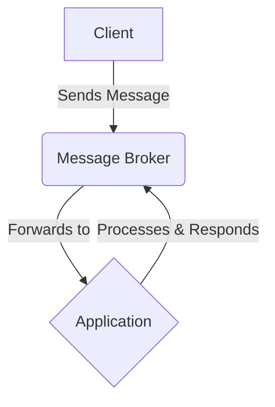

# Styling Guidelines

## CSS Code Style
### CSS Naming Convention
To properly style your css code, use the [BEM(Block, Element, Modifier) methodology](https://getbem.com/introduction/) to name CSS classes. This approach helps to create clear, self-documenting class names. 
- **Block:** A standalone component that is meaningful on its own. (`.card`, `.nav`, `.form`)
- **Element:** A part of a block that has no standalone meaning. It is semantically tied to its block. (`.card__title`, `.nav__link`, `.form__input`)
- **Modifier:** A flag on a block or element used to change appearance or behavior. (`.card--dark`, `.nav__link--active`, `.form__input--error`)

**Example**
```css
/* Block */
.code-snippet {
  position: relative;
  border: 1px solid #ccc;
  border-radius: 4px;
}

/* Element */
.code-snippet__header {
  padding: 8px 12px;
  background-color: #f5f5f5;
  font-weight: bold;
}

/* Modifier */
.code-snippet--dark {
  border-color: #555;
  background-color: #2d2d2d;
  color: #fff;
}
```

### CSS Formatting
- **Indentation:** Use two spaces for indentation.

- **Selectors:** Place each selector on a new line when grouping.

- **Properties:** Declare one property per line. Add a space after the colon (`:`).

- **Closing Brace:** The closing brace (`}`) should be on a new line.

- **Comments:** Use comments to explain complex components or non-obvious logic.

## Typography
Consistent typography is key to readability and visual hierarchy.

### Font
- **Primary Font:** Inter (or a fallback sans-serif like Helvetica, Arial).

- **Monospace Font:** Roboto Mono for all code blocks and inline code.

### Font Size & Weight
- **Base Font Size:** 16px for body text.

- **Line Height:** 1.6 for body text to ensure readability.

| Element | Font Size | Font Weight | Notes  |
|--------|-----|------------|------------|
| `<h1>` | `2.5rem` | `700`(Bold) | Page Title, one per page. |
| `<h2>` | `2rem` | `700`(Bold) | Major Section Headings.    |
| `<h3>` | `1.75rem` | `600`(Semi-Bold) | Sub-section Headings.     |
| `<h4>` | `1.5rem` | `600`(Semi-Bold) | Smaller sub-section Headings.     |
| Body/`<p>` | `1rem`(16px) | `400`(Regular) | Body of the page.     |
| Inline Code ` ` | `0.9rem` | `400`(Regular) | Use the monospace font.     |
| `Caption/Small` | `0.875rem` | `400`(Regular) | For image captions or helper text.    |

## Markdown
Standardize Markdown usage for consistency across all documents.

- **Emphasis:** Use asterisks for italics (*italic*) and bold (**bold**).

- **Links:** Always use descriptive link text. Avoid "click here."

   - **✅Good:** See our [Contribution Guide](/docs/community/contribution-guide) for more.

   - **❌Bad:** For more info, [click here](https://.../contribution-guide).

- **Code Blocks:** Use backticks for inline code (`const foo = 'bar';`). For code blocks, use triple backticks and specify the language for syntax highlighting.

```yaml
asyncapi: 2.5.0
info:
  title: Streetlights API
  version: '1.0.0'
```

## Lists
### Unordered Lists
Use hyphens (`-`) for unordered lists. This provides better visual separation than asterisks. Use two spaces for nested list indentation.

- First level item

  - Second level item

    - Third level item

- First level item

### Ordered Lists
Use numerals (`1.`) for all items in an ordered list. The Markdown renderer will automatically number them correctly, which prevents errors during reordering.

1. First item.

2. Second item.

3. Third item.

## Images
Images should be clear, optimized, and accessible.

- **Format:**

  - **SVG:** For logos, icons, and simple diagrams.

  - **PNG:** For screenshots or images requiring transparency.

  - **JPEG:** For photographs. Optimize for the web to balance quality and file size.

- **Alt Text:** All `` tags must have a descriptive alt attribute for screen readers. If an image is purely decorative, use `alt=""`.

- **Sizing:** Images should not exceed a maximum width of 800px to avoid overwhelming the content layout.

- **Captions:** Use a small, centered text below an image for captions when necessary.

## Diagrams
Diagrams are crucial for explaining complex architectures. Consistency is key.

- **Tool:** Whenever possible, use **Mermaid.js** to create diagrams directly within Markdown. This keeps them version-controlled and easy to update.

- **Style:**

  - **Colors:** Adhere to the AsyncAPI color palette. Use colors meaningfully to distinguish between different types of components (e.g., service, message, topic).

  - **Flow:** Diagrams should flow logically, typically from left-to-right or top-to-bottom.

  - **Clarity:** Avoid clutter. Use clear, concise labels. If a diagram becomes too complex, break it into multiple, simpler diagrams.




## Tables
Use Markdown's pipe table format for simplicity. Ensure columns are properly aligned for readability in the raw markdown file.


| Feature        | Status      | Assigned To |
|----------------|-------------|-------------|
| New Parser     | In Progress | @jane.doe   |
| Kafka Binding  | Done        | @john.doe   |
| Docs Overhaul  | Blocked     | @team/docs  |

## Additional Resources
- https://getbem.com/introduction/
- https://m2.material.io/design/typography/understanding-typography.html
- https://www.markdownguide.org/basic-syntax/
- https://mermaid.js.org/intro/