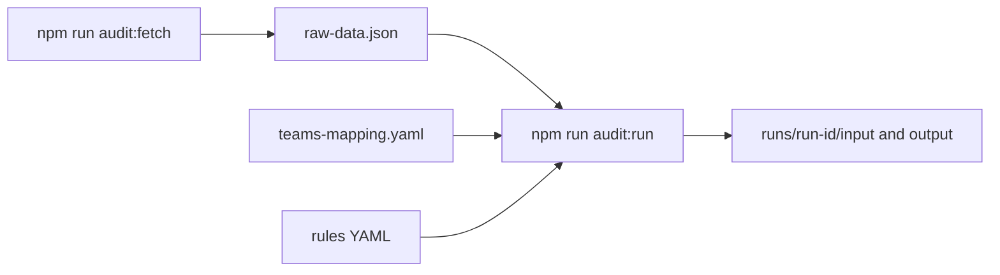

# Audit pipeline: how to run it

This guide is for **operators** who need to run the AsyncAPI org maintainer-activity audit from the terminal. You do not need to know how the scripts are implemented.

**Repository root:** run all commands from the repo root (`community/`), after `npm install`.

---

## What this tool does

1. **Fetch** lists every non-archived `asyncapi/*` repository and downloads each repo’s `CODEOWNERS` (from common paths). It writes a JSON snapshot: **`docs/audit/raw-data.json`** (unless you override `--out`).
2. **Run** reads that snapshot plus your **rules** and **team mapping**, calls the GitHub API to evaluate **activity rules** per maintainer and triager (per repo), and writes a **new folder** under **`docs/audit/runs/<run-id>/`** with frozen inputs and reports.
3. **Repo activity** (optional) uses the same `raw-data.json` and **`window_months` / `bots.deny_pr_authors`** from your rules YAML to collect **per-repository** Search counts (issues/PRs opened and merged, human vs bot, closed issues, closed unmerged PRs). Outputs go to **`docs/audit/repo-activity-runs/<run-id>/`**. **`bots.deny_reviewers`** does not affect these counts (v1 has no review metrics).

There is **no on-disk activity cache**: every `audit:run` recomputes activity from GitHub for the configured time window. If you change rules or `window_months`, run the engine again.

---

## Prerequisites

| Requirement | Notes |
|-------------|--------|
| **Node.js** | Use a version compatible with the project (see CI or `package.json`). |
| **Dependencies** | `npm install` once at repo root. |
| **`GITHUB_TOKEN`** | Required for both steps. Export in the shell: `export GITHUB_TOKEN=ghp_...` |
| **Token scopes** | At minimum **`public_repo`** so the API can read public org repos and use search. Add **`read:org`** if you later extend workflows to sync org team membership via API. |

Never commit the token.

---

## Pipeline overview



---

## End-to-end steps (default path)

1. **Set the token**

   ```bash
   export GITHUB_TOKEN=ghp_...
   ```

2. **Fetch raw data** (repo list + parsed CODEOWNERS)

   ```bash
   npm run audit:fetch
   ```

   Writes **`docs/audit/raw-data.json`**.

3. **Edit** `docs/audit/teams-mapping.yaml` so `@asyncapi/...` teams referenced in CODEOWNERS map to **human** GitHub usernames (required wherever CODEOWNERS names a team instead of individuals).

4. **Run the rule engine**

   ```bash
   npm run audit:run
   ```

   Creates **`docs/audit/runs/<run-id>/`** with `input/` and `output/`.

---

## npm scripts

| Script | Command |
|--------|---------|
| `npm run audit:fetch` | `node scripts/audit-fetch-raw.mjs` |
| `npm run audit:run` | `node scripts/audit-rule-engine.mjs` |
| `npm run audit:repo-activity` | `node scripts/audit-repo-activity.mjs` |
| `npm run audit:merge-maintainer-activity` | `node scripts/audit-merge-maintainer-repo-activity.mjs` |

Pass engine or fetch arguments **after** `--` so npm forwards them:

```bash
npm run audit:run -- --max-repos 5 --rules docs/audit/rules/my-experiment.yaml
npm run audit:repo-activity -- --max-repos 3
```

---

## Step 1: Fetch raw data (`audit-fetch-raw.mjs`)

### Environment

| Variable | Required | Purpose |
|----------|----------|---------|
| `GITHUB_TOKEN` | **Yes** | Authenticates Octokit for org repo listing and file contents. |

### Flags

| Flag | Argument | Default | Meaning |
|------|----------|---------|---------|
| `--out` | file path | `docs/audit/raw-data.json` | Where to write the JSON snapshot. |

### Example

```bash
export GITHUB_TOKEN=ghp_...
npm run audit:fetch
```

Custom output path:

```bash
node scripts/audit-fetch-raw.mjs --out /tmp/my-raw-data.json
```

Repositories in the output are **sorted by repo name**. The rule engine processes repos in the **same order** stored in `raw-data.json`.

---

## Step 2: Run the rule engine (`audit-rule-engine.mjs`)

### Environment

| Variable | Required | Purpose |
|----------|----------|---------|
| `GITHUB_TOKEN` | **Yes** | Search API, commits API, and other endpoints used to evaluate rules. |

### Flags (complete list)

| Flag | Argument | Default | Meaning |
|------|----------|---------|---------|
| `--rules` | file path | `docs/audit/rules/default.yaml` | Rules: `window_months`, `rules[]` (kinds, enabled), `bots`, `aggregation`. |
| `--raw` | file path | `docs/audit/raw-data.json` | Input snapshot from the fetch step (or your own copy). |
| `--teams` | file path | `docs/audit/teams-mapping.yaml` | Maps `@asyncapi/...` team slugs to member logins. |
| `--max-repos` | integer | no limit | Process only the **first N** repositories in `raw-data.json` order (use for quick tests). |

### Examples

**Defaults (full org, default rules):**

```bash
export GITHUB_TOKEN=ghp_...
npm run audit:run
```

**Limit repos (smoke test):**

```bash
npm run audit:run -- --max-repos 3
```

**Custom rules file** (e.g. different `window_months` or enabled rule kinds):

```bash
cp docs/audit/rules/default.yaml docs/audit/rules/my-audit.yaml
# edit my-audit.yaml (e.g. window_months: 6)
npm run audit:run -- --rules docs/audit/rules/my-audit.yaml
```

**Custom paths for inputs:**

```bash
npm run audit:run -- --raw /path/to/raw-data.json --teams /path/to/teams-mapping.yaml
```

---

## Step 3: Repo-level activity (`audit-repo-activity.mjs`)

Use this for **org / consolidation** views: how busy each repo is in the window, with **human** counts excluding **`bots.deny_pr_authors`** (same list as maintainer auditing). Counts come from the **GitHub Search API** (paced like the rule engine).

### Environment

| Variable | Required | Purpose |
|----------|----------|---------|
| `GITHUB_TOKEN` | **Yes** | Search API. |

### Flags

| Flag | Argument | Default | Meaning |
|------|----------|---------|---------|
| `--rules` | file path | `docs/audit/rules/default.yaml` | **`window_months`** and **`bots`** (only `deny_pr_authors` affects human vs bot splits). |
| `--raw` | file path | `docs/audit/raw-data.json` | Repo list (same as maintainer audit). |
| `--max-repos` | integer | no limit | First **N** repos only (testing). |

### Metrics (per repo)

| Field | Meaning |
|-------|--------|
| `issues_opened_total` / `issues_opened_human` | Issues **created** in window; human = excludes `-author:` for each `deny_pr_authors` entry. |
| `prs_opened_total` / `prs_opened_human` | PRs **created** in window. |
| `prs_merged_total` / `prs_merged_human` | PRs **merged** in window (`merged:>=since_day`). |
| `prs_merged_by_bot_author` | Map of **merged** PR count **authored** by each denied bot login. |
| `issues_closed` | Issues **closed** in window. |
| `prs_closed_not_merged` | PRs **closed** without merge in window (`is:closed is:unmerged`). |
| `_errors` | Optional: Search **422** or other captured errors per metric. |

Raw JSON records **`window.since_day`** and **`generated_at`** (fetch time), not per-item timestamps.

### Example

```bash
export GITHUB_TOKEN=ghp_...
npm run audit:repo-activity
```

### Outputs

**`docs/audit/repo-activity-runs/<run-id>/`**

| Path | Purpose |
|------|--------|
| `input/manifest.json` | `audit_kind: repo_activity`, `repo_activity_version`, `since_day`, `window_months`, `bots`, paths. |
| `input/raw-data.json`, `input/rules.yaml` | Snapshots used. |
| `output/repo-activity-raw.json` | Full report. |
| `output/repo-activity-summary.json` | Compact `repos[]` + metrics. |
| `output/repo-activity-summary.md` | Table sorted by **human merged PRs** (ascending). |

**Duration:** ~10 Search calls per repo (plus pacing). Full org can take **tens of minutes**.

### Merge maintainer summary + repo activity

After you have **`runs/<id>/output/summary.json`** and **`repo-activity-runs/<id>/output/repo-activity-summary.json`**, you can combine them (same **`full_name`** per repo) into reports sorted by **active maintainer count**:

```bash
npm run audit:merge-maintainer-activity -- \
  --maintainer-summary docs/audit/runs/20260329T084806Z/output/summary.json \
  --repo-activity-summary docs/audit/repo-activity-runs/20260418T185703Z/output/repo-activity-summary.json
```

Optional: `--out-dir <dir>` (default: directory of the repo-activity summary). Optional: `--emeritus-candidates <emeritus-candidates.md>` (default: `emeritus-candidates.md` in the same folder as `summary.json`).

**Writes next to the repo-activity summary (unless `--out-dir` is set).** See **`analysis-reports-index.md`** in that folder for the full list. Highlights:

| File | Purpose |
|------|--------|
| `analysis-reports-index.md` | Catalog of every generated merge report. |
| `at-risk-scorecard.md` / `.json` | Heuristic **risk rank** (coverage + **human-only** traffic + emeritus count; bot merges not scored). JSON includes `at_risk_parts` and `analysis_activity_basis`. |
| `emeritus-candidates-by-repo.md` / `.json` | **One row per repo**: all emeritus candidate logins (grouped from `emeritus-candidates.md`). |
| `maintainer-tier-roster.md` / `.json` | Repos ordered **0 → N** active maintainers; columns: active list, **inactive maintainers** (audit “emeritus risk”), active / inactive triagers. |
| `active-maintainer-distribution.md` / `.json` | **Count of repos** per active-maintainer tier (0, 1, 2, …). |
| `critical-repos-analysis.md` / `.json` | Coverage + **human-only** issue/PR activity (spreadsheet-friendly JSON; raw totals remain in `merged` / `repo-activity` JSON). |
| `merged-repo-activity-by-maintainer-count.json` | Full merge: lists, counts, triagers, `metrics`. |
| `merged-repo-activity-by-maintainer-count.md` | Activity table + maintainer counts + login appendix. |
| `repo-maintenance-load.md` | `prs_merged_human / active_maintainer_count` (descending). |
| `consolidation-signals.json` | Repos with **zero** active maintainers (`repos_high_bot_merge_share` is always empty; bots treated as non-signal in merge analysis). |

---

## When to use what

| Goal | What to do |
|------|------------|
| **Full org audit** | `audit:fetch` then `audit:run` with **no** `--max-repos`. |
| **Quick local test** | `npm run audit:run -- --max-repos 3` (or another small N). |
| **Different time window or rules** | Copy/edit a YAML file under `docs/audit/rules/`, pass `--rules`. |
| **Latest CODEOWNERS** | Run `npm run audit:fetch` again before `audit:run` (the engine reads whatever file `--raw` points to at run time). |
| **Rule or aggregation change** | Edit the rules YAML and run `audit:run` again. No cache to clear—each run is a full API evaluation for that window. |
| **Repo-level issue/PR activity (S1 / consolidation)** | After `audit:fetch`, run `npm run audit:repo-activity` (same `window_months` / bots if you use `default.yaml`). |
| **Merge maintainer health + repo traffic** | Run `audit:merge-maintainer-activity` with paths to `summary.json` and `repo-activity-summary.json`. |

---

## Outputs per run (maintainer audit)

After `npm run audit:run`, a new directory appears:

**`docs/audit/runs/<run-id>/`**

| Path | Purpose |
|------|--------|
| `input/raw-data.json` | Copy of the raw snapshot used. |
| `input/teams-mapping.yaml` | Copy of teams used. |
| `input/rules.yaml` | Copy of the rules file used. |
| `input/manifest.json` | Metadata: `run_id`, `engine_version`, `started_at`, paths, `argv`, `git_sha`, `max_repos` (if any). |
| `output/full-report.json` | Machine-readable: per repo, per person, per rule, pass/fail, evidence. |
| `output/full-report.md` | Human-readable long report. |
| `output/summary.md` / `summary.json` | Short active vs inactive lists per repo. |
| `output/emeritus-candidates.md` | Table of inactive **maintainers** (review candidates). |

Global **`docs/audit/emeritus-log.md`** is for human/TSC notes after review; the engine does not overwrite it.

---

## Operational expectations

- **Search API:** Authenticated users get about **30 search requests per minute**. The engine **paces** search calls (~2.2s apart) and **retries** after `403` when GitHub reports a secondary rate limit.
- **Duration:** Full-org runs can take **on the order of 15–45+ minutes** depending on maintainer count and network. Use `--max-repos` for faster iteration.
- **422 on search:** Some handles in CODEOWNERS are not searchable (placeholders, invalid `author:` users). Those rules **fail** with an explanatory reason; the run continues.
- **Rule kinds:** See [`rules/RULE_TYPES.md`](rules/RULE_TYPES.md) for what each `kind` string means.

---

## Further reading

- **[README.md](README.md)** — Overview and global files table.
- **[rules/RULE_TYPES.md](rules/RULE_TYPES.md)** — Rule `kind` reference.
- **[CHANGELOG.md](CHANGELOG.md)** — Engine and documentation changes.
