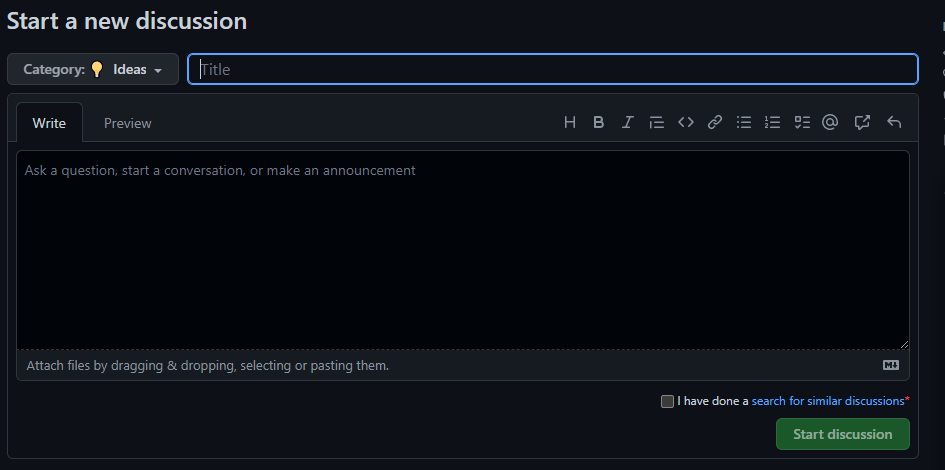

# How to create new repository

This document is not about creating a repository on GitHub. If this is what you were looking for, then [read GitHub guides on repository creation](https://docs.github.com/en/get-started/quickstart/create-a-repo).

This document is about creating a new repository at [AsyncAPI Initiative GitHub organization](https://github.com/asyncapi). This guide explains what is the approval process and default repository configuration options.

This document is also helpful if you are donating a project to AsyncAPI Initiative, which involves transferring repository ownership, but still becoming its maintainer.

## Creating a Repo for new project in Asyncapi

1. Visit [asyncapi initaitive on Github](https://github.com/asyncapi) click on `Discussion tab` to start new discussion.

2. Click on `New discussion`, select `Category` add a `title`, ping [Lukasz Gornick](https://github.com/derberg) or [Fran Méndez](https://github.com/fmvilas) in your discussion about the new project.

### Note: 
There are 9 categories to every dicussion that been discuss here on asyncapi organization, each of these ctategories represent what you are proposing to the technical steering commitee.

3. After starting a discussion about your new project for asyncapi, and successfully convienced other members of the community why your project ideas is necessary and you want to maintain the codebase.

-----------------------------

## Configuring the repo

## Donating a project to asyncapi
