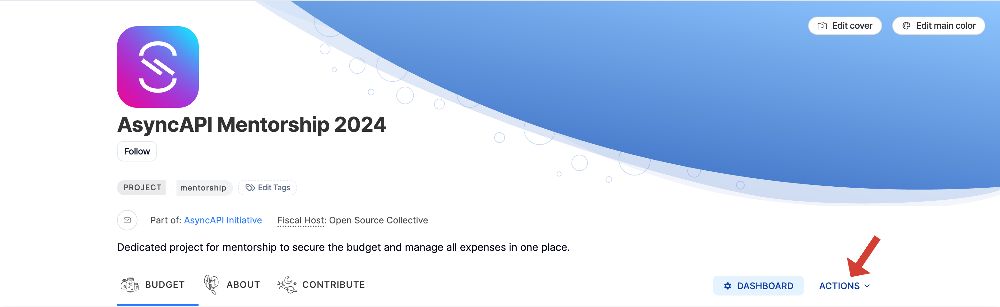
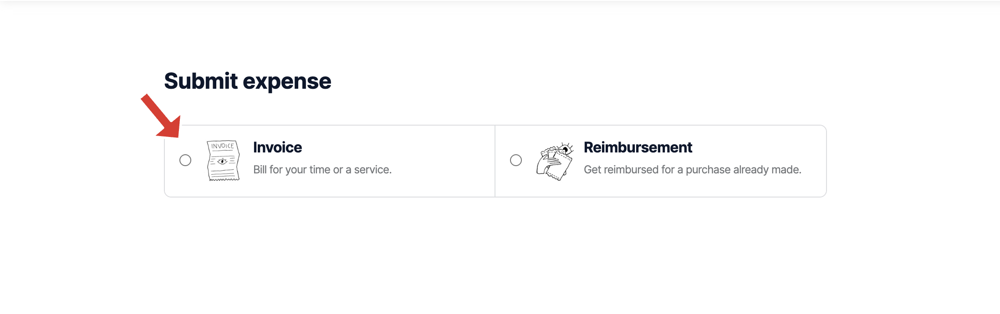

>_The AMP participants may receive stipends from AsyncAPI, which are at AsyncAPI's sole discretion and are not adjusted to the cost of living. All participants will receive an equal amount of stipends during the program participation._

The **AsyncAPI Maintainership Program (AMP)** offers stipends as a token of appreciation for the time and effort invested by contributors and mentors. These stipends are disbursed upon successful completion of key milestones and evaluations.
## Contributor Stipends

Contributors receive their stipend in **two installments**:

- **50% after passing the Midterm Evaluation**

- **50% after passing the Final Evaluation**

To be eligible, contributors must meet all evaluation criteria and submit the required deliverables on time.

## Mentor Stipends

Mentors receive a flat stipend of **$500**, which is paid **after the completion of the program**, once they have:

- Completed both midterm and final evaluations for their assigned contributor

- Actively supported their mentee throughout the program

- Received a passing evaluation from their contributor

## How to Request Your Stipend

All stipend disbursements are processed through the official [AsyncAPI Mentorship Open Collective](https://opencollective.com/asyncapi/projects/asyncapi-mentorship) page.

Follow these steps to request your payment:

1. Visit the [Mentorship Open Collective page](https://opencollective.com/asyncapi/projects/asyncapi-mentorship)
   
2. Click the **Actions** button

3. Select **Submit Expense**

4. Toggle to **Invoice** mode

5. Fill in the required information for payment and submit your request

6. Submit your expense