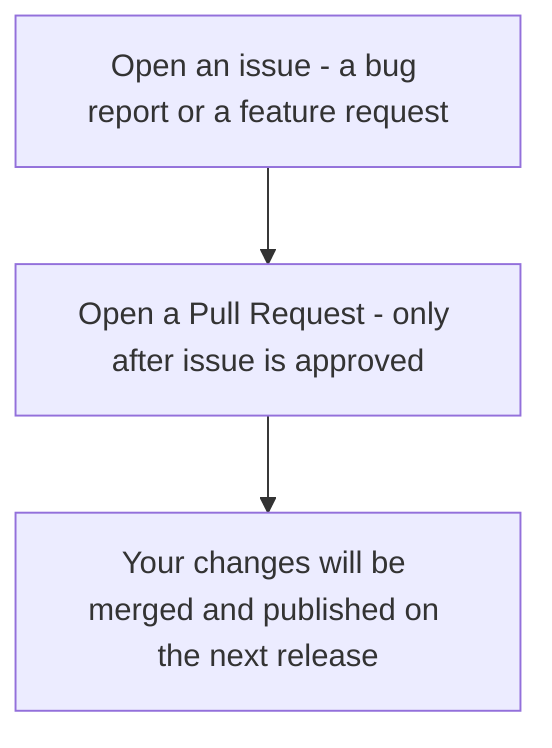

# Contributor - Simple Contribution Flow
This guide explains how to contribute effectively to AsyncAPI. It guides you through the contribution process and provides a checklist to ensure high-quality contributions. 

## Making a Contribution
We welcome your contributions to AsyncAPI, whether you have suggestions, improvements, or new ideas. 

At AsyncAPI, we value **quality over quantity**. This guide will help you make meaningful contributions that benefit the community.

### Before You Start Contributing
- If you are joining AsyncAPI through [Slack](https://asyncapi.com/slack-invite) or an event, take your time to explore the [AsyncAPI website](https://www.asyncapi.com/).  
- Read our [Code of Conduct](https://github.com/asyncapi/.github/blob/master/CODE_OF_CONDUCT.md).  
- [Attend meetings](https://www.asyncapi.com/community/events) and engage in discussions in the [`#11_contributing` Slack channel](https://asyncapi.com/slack-invite).
- Read the [documentation](https://www.asyncapi.com/docs) to learn more about AsyncAPI.

### Before Making a Contribution
- Read the [onboarding contributor guide](https://www.asyncapi.com/docs/community/onboarding-guide).
- If you are contributing to the community repository, review the [documentation onboarding checklist](https://www.asyncapi.com/docs/community/onboarding-guide/docs-onboarding-checklist). 
- For other repositories, refer to the [general contribution guidelines](https://github.com/asyncapi/community/blob/master/CONTRIBUTING.md).
- Look through existing issues and pull requests to understand the repository better.
- Check the [general roadmap](https://www.asyncapi.com/roadmap).

### Steps to making a good contribution
- Set up your workflow environment using the [git workflow guide](/asyncapi/community/blob/master/git-workflow.md).
- Search for [good first issues](https://github.com/issues?page=1&q=is%3Aopen+org%3Aasyncapi+sort%3Aupdated-desc+label%3A%22good+first+issue%22). 
- When you do find one, request to be assigned.
- If you noticed a bug, typo, or improvement, feel free to create an issue.
- **Make a PR only after a maintainer assigned the issue to you** even if you created the issue yourself.
- Follow the [conventional commits guide](conventional-commits) to write a good PR title.
- Follow the [git workflow document](/asyncapi/community/blob/master/git-workflow.md) when working on your changes and making a PR.
- After making a PR, patiently wait for reviews.
- Make sure all your PR checks pass (turn green) to speed up the merging process.  
- If your PR hasn’t been reviewed after a week and half, you can gently remind a maintainer on Slack or GitHub. Delays can happen for various reasons, but no one is ignoring you! 🙏🏼 .

## Contribution Flow
This is a summary of the ideal contribution flow.

## Contribution Checklist
Before submitting your contribution, ask yourself:
- [x] Is my contribution relevant to AsyncAPI?
- [x] Have I explained why this contribution is necessary?
- [x] Is my writing clear, concise, and well-structured?
- [x] Did I follow the [documentation style guide](https://github.com/asyncapi/community/tree/master/docs/styleguide)?
- [x] Are my code examples tested and functional?
- [x] Have I linked any relevant issues, discussions, or existing docs?
- [x] Did I provide a description of the changes in my PR?
- [x] Am I open to feedback and revisions?

If you answered **yes** to all these questions, you are ready to submit your PR or create an issue! 🚀  
