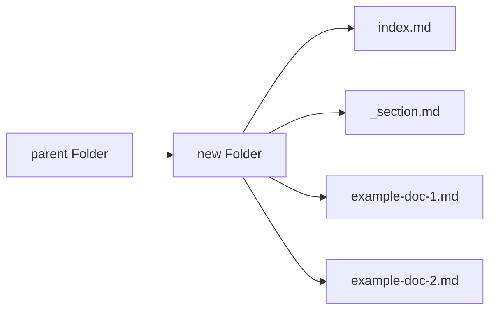

### Create new docs directories/folders
To create a new folder, take the following steps:
1. Indentify the content bucket your document shall fall under.
2. Open the project locally and navigate to the parent folder.
3. On the parent folder, right-click and click on 'new-folder'.
4. Give an appropriate name to the new-folder.
5. Add the following two files to the new-folder:
    1. `index.md` : This file is often used as the main content for a website's directory or specific webpage. It's called "index" because many web servers are configured to automatically look for an "index" file when accessing a directory. When you access a directory on a web server, if an "index.md" file is present, it will be displayed as the default page for that directory.
    2. `_section.md` : This file is used for reusable components or partial content within a website's structure. Use this file to define the page's ‘title’ and ‘weight’. Where title is used to define a ‘human-readable’ title, and weight is used to control the order or priority of how sections or components are displayed.
6. After successfully creating these pages, you can start editing the index page. 

