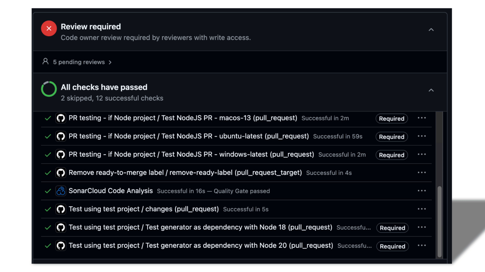
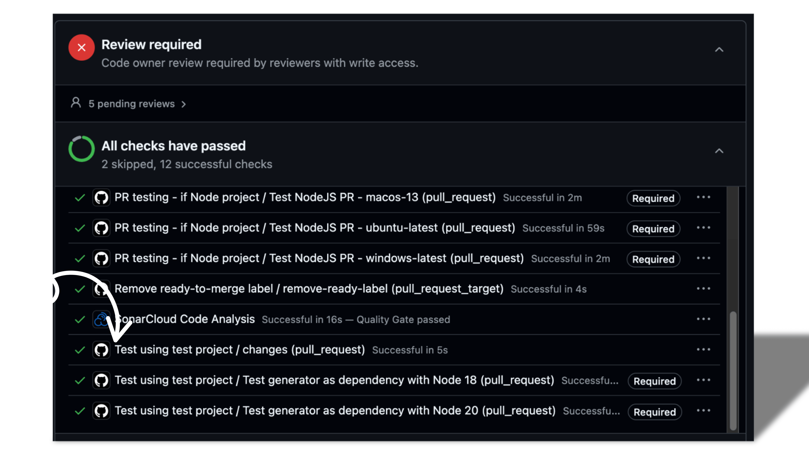

## Where local workflows are defined

Local workflows live inside a specific repository, under the `.github/workflows` directory. That’s where you’ll find all the workflow files, written in YAML and saved with either a `.yml` or `.yaml` extension.

## How to define a new local workflow

Defining a local workflow is pretty straightforward, but it's important to note that only designated maintainers of a given repository within the organization can create a local workflow.

Before creating a new one, ask yourself: _Does this workflow already exist in another repository within the org?_  
If the answer is yes, do you really want to reinvent the wheel? Instead, consider proposing it as a **global workflow** so that other maintainers can benefit from it too. Sharing is caring, right?

If the workflow doesn't exist anywhere in the org, then you should follow the step below:

- **Step One:** 
  Navigate to the `.github/workflows` directory in the target repository — this is where all existing workflows are defined.

- **Step Two:**
   Create a new workflow file, naming it after the workflow’s functionality so it’s easy to identify its purpose. Make sure it ends with a `.yml` or `.yaml` extension.

- **Step Three:** 
  At the top of your workflow file, add a `# comment` that briefly explains what the workflow does.

- **Step Four:** 
  Define the `name` property of the workflow, making sure it clearly reflects its intended purpose. The name you define is what GitHub displays under your repository's "Actions" tab.

- **Step Five:** 
  Define the event(s) that should trigger your workflow. This could be a `push`, `pull_request`, or any other supported event. You can explore the full list of available triggers [here](https://docs.github.com/en/actions/writing-workflows/choosing-when-your-workflow-runs/events-that-trigger-workflows).

- **Step Six:**
  Specify the list of jobs the workflow will perform. Use clear job names like `build`, `test`, or `deploy`. This makes it easier to debug if something breaks. Learn more about defining jobs in a workflow [here](https://docs.github.com/en/actions/writing-workflows/choosing-what-your-workflow-does/using-jobs-in-a-workflow).

- **Step Seven:**
  Inside each job, define the **steps** to run, for example:
    - Checking out repository
    - Running scripts or tests
    - Setting up the environment

- **Step Eight:** 
  Define `permissions` or `env` variables if needed. Some workflows might require access to GitHub tokens, secrets, or environment variables.

- **Step Nine:**
  Test the workflow!  Create a test branch or open a dummy PR to verify everything runs smoothly before merging it into main.

## Local Workflow Example

We have quite a number of local workflows scattered across different repos in the org, but for this example, we’re going to use the [**test workflow**](https://github.com/asyncapi/generator/blob/master/.github/workflows/pr-testing-with-test-project.yml) in the `asyncapi/generator` repo to show a local workflow in action.

This particular workflow is responsible for running tests in the test projects to make sure the generator behaves correctly when it’s being used as a library where it is a Node dependency along with the template.

### Where's this workflow being used?

This workflow gets triggered on `Pull Requests`, which is pretty common across most of our workflows in the org.

So, let’s say a new PR is opened in the `generator` repository, all the workflows that are set to run on `Pull Requests`, including this test workflow, will automatically kick in. You'll see them fired up in the Actions section in the bottom-most part of the pull request, just like in the image below. 



### Identify Which workflow checks belongs to this `Test Workflow`?

That’s exactly why naming your workflows properly is a big deal. The easiest way to spot a specific workflow among the list of checks is by its name.

If you [jump into the test workflow file](https://github.com/asyncapi/generator/blob/master/.github/workflows/pr-testing-with-test-project.yml), you’ll notice the `name` field is right at the top, that’s what shows up in the Actions tab when the workflow runs.

And right below that, you can clearly see it’s set to trigger only on `Pull Requests`, which means any time a PR is opened, reopened, synced, or marked ready for review, this workflow gets to work. Here's what that bit looks like:

```
name: Test using test project

on:
  pull_request:
    types: [opened, reopened, synchronize, ready_for_review]
```

And just like that, you can easily spot the workflow that matches the name defined in the workflow file by checking the image below.



But if you take a closer look at the image above, you’ll notice two separate checks testing the generator as a dependency, but with different Node versions. That’s not a coincidence. It’s made possible by the test strategy defined in the job configuration of the workflow.

```
test:
    needs: changes
    if: ${{ github.event.pull_request.draft == false }}
    name: Test generator as dependency with Node ${{ matrix.node }}
    runs-on: ubuntu-latest
    strategy:
      matrix:
        node: ["18", "20"]
```

In the snippet above, we’ve defined a matrix strategy to test against multiple Node versions. This is exactly why you’re seeing those two separate checks in the Actions tab, each one represents a different value from the matrix. Pretty neat, right? You can already see a pattern how the workflow matches to something that is actually executed.