### Automate paper work around project governance

This project aims to automate maintaining the Maintainers.yaml file which contains the list of maintainers and TSC members of AsyncAPI. The tasks involve implementing workflows to automatically update the member's list based on changes in other files, inviting new maintainers and TSC members, updating the Emeritus.yaml file when someone is removed, and aggregating helpful information in the Maintainers.yaml file. These automation and improvements will make it easier to manage the maintainers and TSC members of AsyncAPI.

The first graph outlines the steps to automate the updating of Maintainers.yaml. This involves migrating to YAML, updating the website code to handle YAML format, automating the updation of Maintainers.yaml, creating a validation workflow to block pull requests if records are added/removed by humans, creating an update-maintainers workflow, and allowing humans to update social info and TSC member property.

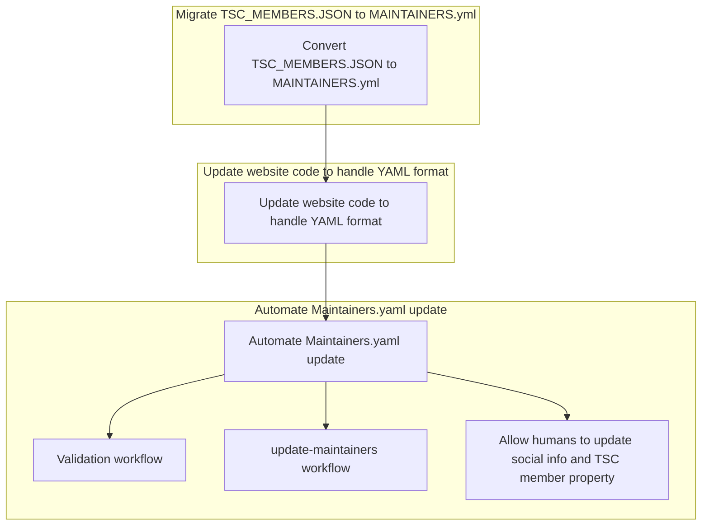

The second graph outlines the steps for onboarding new maintainers. This involves creating an invitation workflow, creating a TSC member change workflow, and creating a notification workflow to inform existing members about the new addition.

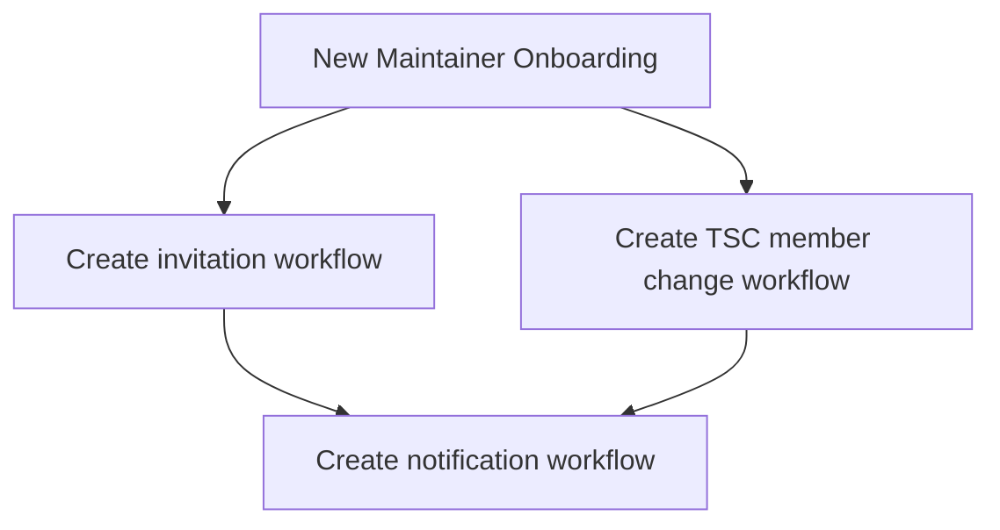

The third graph outlines the steps for updating the Emeritus.yaml file. This involves creating a removal workflow to remove members from the organization/team, and creating a pull request review workflow to ensure that changes are reviewed by a human before merging.

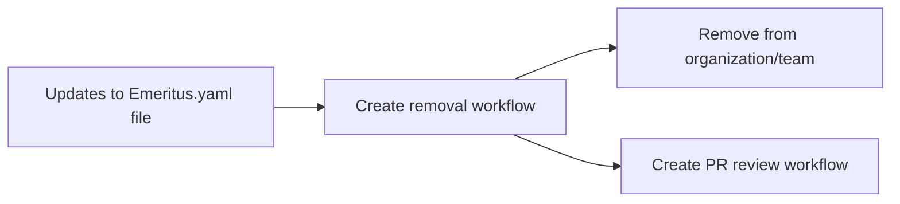

Overall, these subgraphs represent a comprehensive approach to maintaining and updating the YAML files related to maintainers and TSC members, ensuring that new maintainers are onboarded effectively, and keeping the Emeritus.yaml file up to date. This approach involves a range of workflows and automated processes to streamline these tasks.

### Workflows

### `validate-maintainers.yaml`

This workflow listens for changes to the Maintainers.yaml file and validates whether the changes were made by the bot or a human. If a human made the changes, the workflow blocks the pull request and notifies the user with a proper message.

The validation passes if:

- The changes are made by the approved bot account.

> Note: This workflow should be located only in the community repository and should be made a required status check in the repository settings, so if it fails, PR cannot be merged.

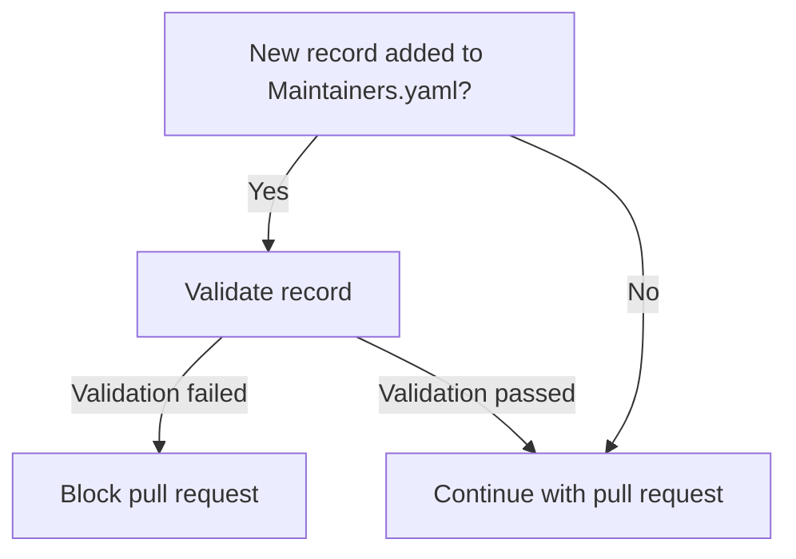

### `update-maintainers.yaml`

This workflow listens for changes to the CODEOWNERS file and updates the Maintainers.yaml file accordingly. It also picks up the GitHub username, Twitter handle, and the name of the maintained repository from the API and notifies the affected users.

> Note: This workflow should be located in every repository. It should be configured with permissions to update the Maintainers.yaml file in the community repository.

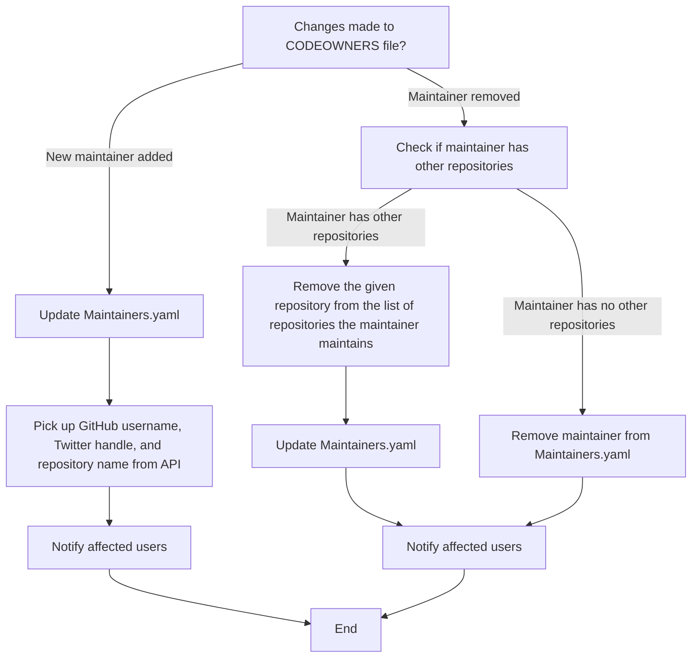

### `allow-updates.yaml`

This workflow allows humans to update social info or the tsc_member property in the Maintainers.yaml file.

> Note: This workflow should be located only in the community repository.

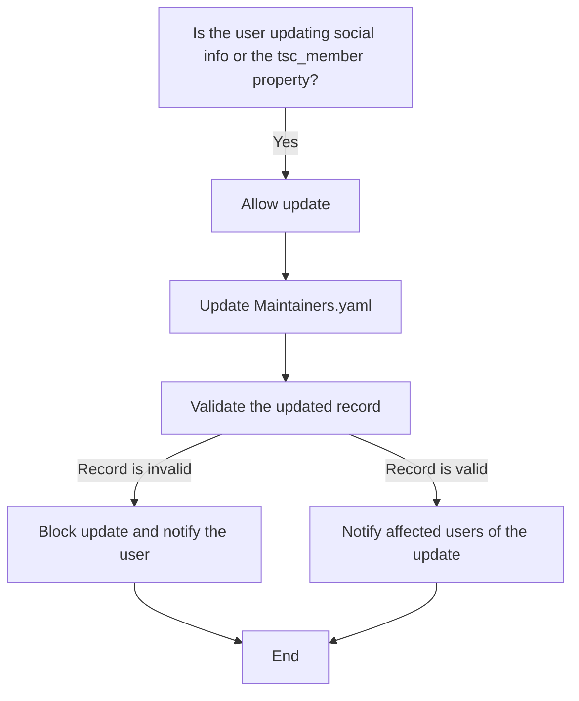

### `invite-maintainers.yaml`

This workflow is triggered when a new maintainer is added. It calls the GitHub API to invite the maintainer to the AsyncAPI organization and adds to an existing team for the maintainers. The workflow also adds the new maintainer to the Maintainers GitHub team.

> Note: This workflow should be located in the community repository.

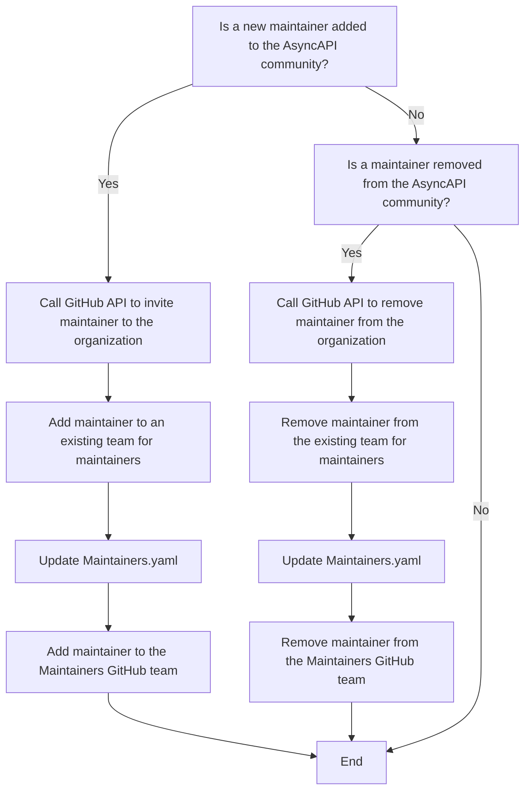

### `tsc-and-maintainers-update.yaml`

This workflow manages changes to the TSC team and the Maintainers list of a project. The workflow is triggered when there is a change to either the "tsc_member" property or the "Maintainers.yaml" file.

If a maintainer is removed from the Maintainers list, the workflow removes that person from the organization and teams.

If there is a change to the "tsc_member" property, the workflow adds or removes the member from the TSC team based on the value of the property. If a member is added to the TSC team, the workflow notifies affected users.

If there are no changes made to the TSC team or the Maintainers list, the workflow ends.

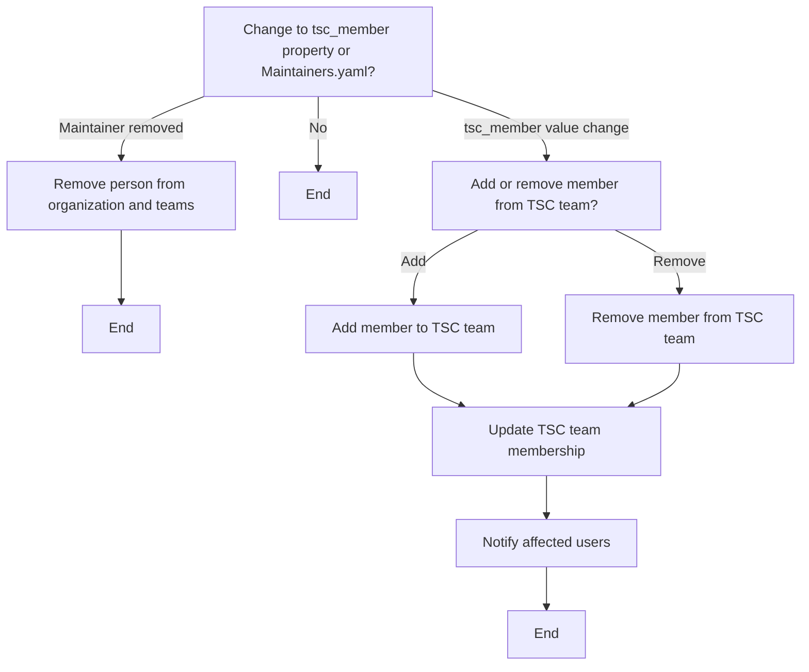

### `notify-tsc-members.yaml`

This workflow is triggered when a new member is added to the TSC. It notifies the new member about ways to get notified when TSC members are called out and notifies other TSC members by mentioning the GitHub team.

> Note: This workflow should be located in the community repository.

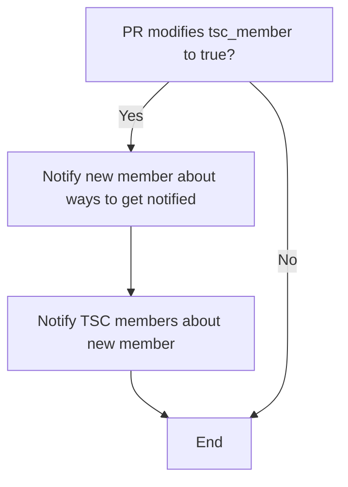

### `update-emeritus.yaml`

This workflow is triggered when someone is removed from the Maintainers.yaml file because they no longer maintain any repository. It updates the Emeritus.yaml file with the list of people that left the project.

> Note: This workflow should be located in the community repository.

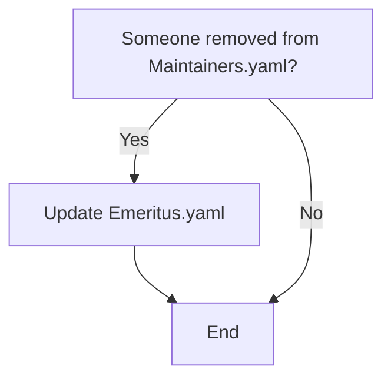

#### Workflow Diagram: Interconnections between Workflows

The following charts showcases the interconnections between different workflows that collectively automate the process of maintaining and updating the Maintainers.yaml file.

#### CODEOWNER Add/Remove

This flowchart illustrates the streamlined process for managing changes to a CODEOWNERS file. When changes are detected, the flowchart outlines steps for adding or removing a maintainer. For additions, it retrieves the new maintainer's information, updates Maintainers.yaml, validates changes, sends an invitation to the new maintainer, and notifies TSC members. For removals, it retrieves the removed maintainer's information, updates Maintainers.yaml, moves the removed maintainer's information to Emeritus.yaml, removes them from the organization, and notifies TSC members.

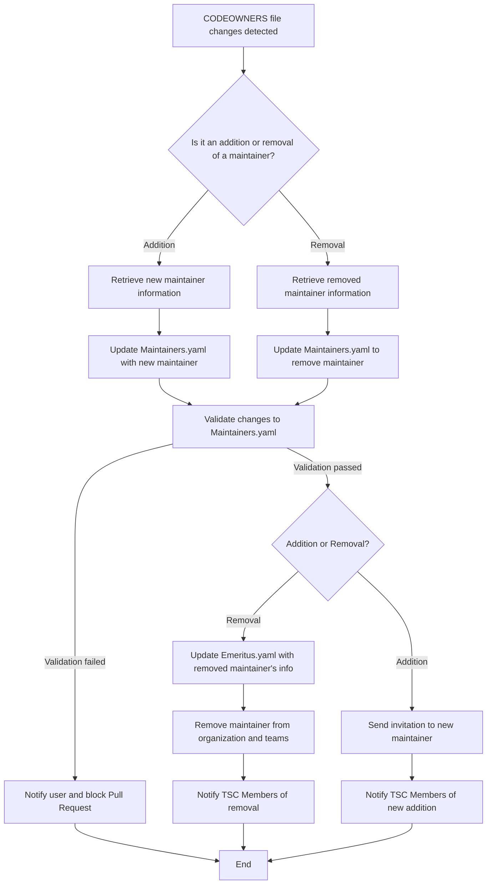

Below flowchart also depicts an independent process for maintainers who wish to update their information through a separate pull request. It involves validating the changes and either updating the Maintainers.yaml file or blocking the pull request if validation fails.

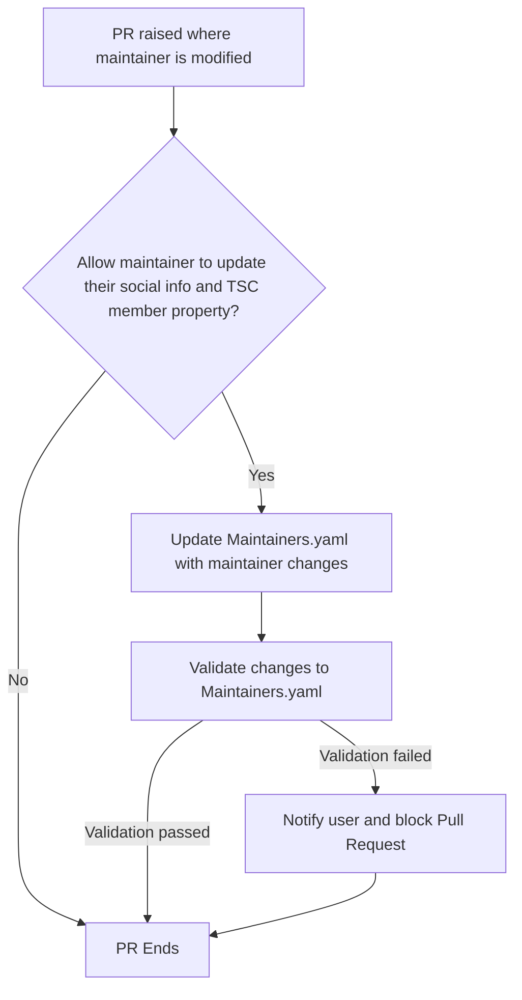
