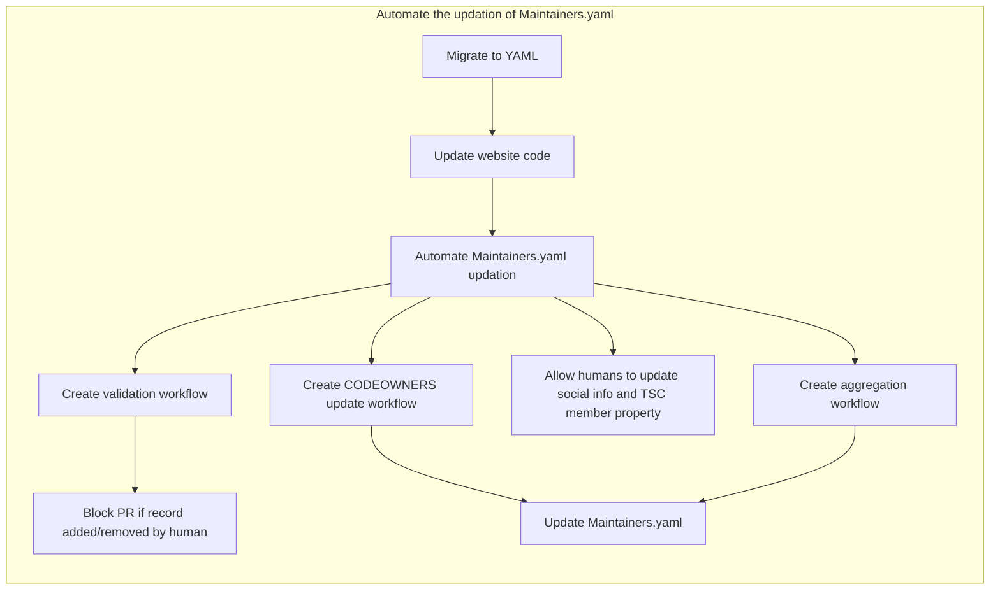
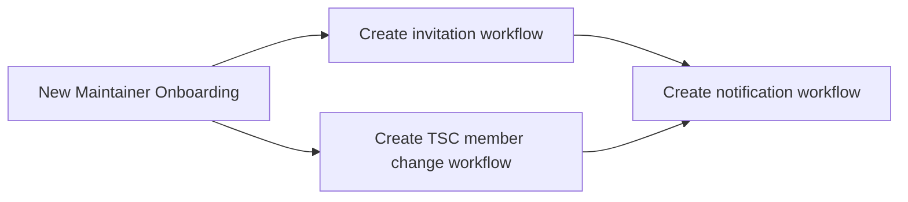
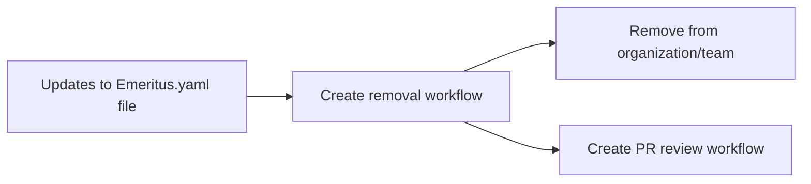
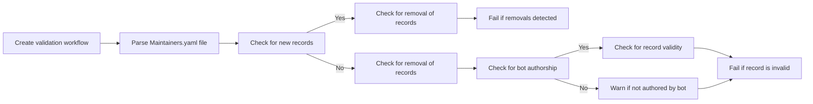

### Automate paper work around project governance

 This project aims to automate maintaining the Maintainers.yaml file which contains the list of maintainers and TSC members of AsyncAPI. The tasks involve implementing workflows to automatically update the member's list based on changes in other files, inviting new maintainers and TSC members, updating the Emeritus.yaml file when someone is removed, and aggregating helpful information in the Maintainers.yaml file. These automation and improvements will make it easier to manage the maintainers and TSC members of AsyncAPI.

The flowchart describes three subgraphs related to the maintenance of Maintainers.yaml, onboarding of new maintainers, and updates to Emeritus.yaml file.

The first subgraph outlines the steps to automate the updating of Maintainers.yaml. This involves migrating to YAML, updating the website code to handle the new format, automating the updating of Maintainers.yaml, creating a validation workflow to block pull requests if records are added/removed by humans, creating a CODEOWNERS update workflow, allowing humans to update social info and TSC member property, and creating an aggregation workflow to provide information on the number of TSC members, per company information, and the number of members that can be added by each company.

The second subgraph outlines the steps for onboarding new maintainers. This involves creating an invitation workflow, creating a TSC member change workflow, and creating a notification workflow to inform existing members about the new addition.

The third subgraph outlines the steps for updating the Emeritus.yaml file. This involves creating a removal workflow to remove members from the organization/team, and creating a pull request review workflow to ensure that changes are reviewed by a human before merging.

Overall, these subgraphs represent a comprehensive approach to maintaining and updating the YAML files related to maintainers and TSC members, ensuring that new maintainers are onboarded effectively, and keeping the Emeritus.yaml file up to date. This approach involves a range of workflows and automated processes to streamline these tasks and ensure they are completed efficiently andaccurately. By implementing this approach, the team can manage these tasks more effectively and focus on other important aspects of software development and website maintenance.

### Validation Workflow 

